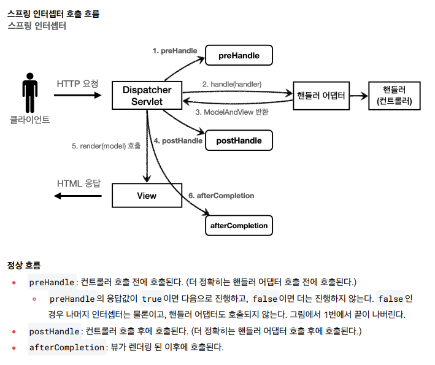

# 스프링 MVC 2편 - 백엔드 웹 개발 활용 기술

## 1. 타임리프 기본 기능

### 타임리프 소개
Thymeleaf는 웹과 독립형 환경 모두를 위한 최신 서버 사이드 Java 템플릿 엔진이다.

Tymeleaf의 주요 목표는 개발 워크플로우에 우아하고 자연스러운 템플릿을 제공하는 것이다.

즉, 브라우저에서 올바르게 표시될 수 있고 정적 프로토타입으로도 작동하는 HTML을 제공하여 개발팀에서 더욱 긴밀한 협업을 가능하게 한다.

Spring Framework용 모둘과 즐겨쓰는 도구와의 다양한 통합 기능, 그리고 사용자가 직접 만든 기능을 플러그인으로 추가할 수 있는 기능을 갖춘 
Thymeleaf는 최신 HTML5 JVM웹 개발에 이상적이다.

### 타임리프 특징
- 서버 사이드 HTML 렌더링 (SSR)
  - 타임리프는 백엔드 서버에서 HTML을 동적으로 렌더링 하는 용도로 사용된다.
- 네츄럴 템플릿
  - 타임리프로 작성한 파일은 HTML을 유지하기 때문에 웹 브라우저에서 파일을 직접 열어도 내용을 확인할 수 있고, 서버를 통해 뷰 템플릿을 거치면 동적으로 변경된 결과를 확인할 수 있다.
- 스프링 통합 지원
  - 타임리프는 스프링과 자연스럽게 통합되고, 스프링의 다양한 기능을 편리하게 사용할 수 있게 지원한다.

### 타임리프 기본 기능
- 타임리프 사용 선언: \<html xmlns:th="http://www.thymeleaf.org">
- 기본 표현식(간단한 표현)
  - 변순 표현식: ${...}
  - 선택 변수 표현식: *{...}
  - 메시지 표현식: #{...}
  - 링크 URL 표현식: @{...}
  - 조각 표현식: ~{...}
- 기본 표힌식(리터럴)
  - 텍스트: 'text'
  - 숫자: 0, 1, 2
  - 불린: true, false
  - 널: null
  - 리터럴 토큰: one, sometext
- 기본 표현식(문자 연산)
  - 문자 합치기: +
  - 리터럴 대체: |The name is ${name}|
- 기본 표현식(산술 연산)
  - Binary operators: +, -, *, /, %
  - Minus sign(unary operator): -
- 기본 표현식(불린 연산)
  - Binary operators: and, or
  - Boolean negation(unary operator): !, not
- 기본 표현식(비교와 동등)
  - 비교: >, <, >=, <= (gt, lt, ge, le)
  - 동등연산: ==, != (eq ne)
- 기본 표현식(조건 연산)
  - If-then: (if) ? (then)
  - If-then-else: (if) ? (then) : (else)
  - Default: (value) ?: (defaultValue)
- 기본 표현식(특별한 토큰)
  - No-Operation: _

### 텍스트 - text, utext
타입리프의 가장 기본 기능인 텍스트를 출력하는 기능
- HTML의 콘텐츠에 데이터를 출력하는 경우
  - `th:text`
  - `<span th:text="${data}">`
- HTML 태그 속성이 아닌 HTML 콘텐츠 영역안에 직접 데이터 출력
  - `[[...]]`
  - `[[$data]]`
#### Escape
타임리프가 제공하는 `th:text`, `[[...]]` 는 기본적으로 이스케이프를 제공한다.
#### Unescape
이스케이프 기능을 사용하지 않으려면 `th:utext`, `[(...)]`을 사용한다.

### 변수 - SrpingEL
타임리프에서 변수를 사용할 때는 변수 표현식을 사용한다. `${...}`
- SpringEL 다양한 표현식 사용 (user, users, userMap)
  - Object
    - user.username
    - user['username']
    - user.getUsername
  - List
    - users[0].username
    - users[0]['username']
    - users[0].getUsername
  - Map
    - userMap['userA'].username
    - userMap['userA'].['username']
    - userMap['userA'].getUsername()

#### 지역 변수 선언
`th:with`를 사용하면 지역 변수를 선언해서 사용할 수 있다. `th:with="first=${users[0}"`

### 기본 객체들
타임리프는 기본 객체들을 제공한다.
- ${#request} - 스프링 부트 3.0부터 제공하지 않는다.
- ${#response} - 스프링 부트 3.0부터 제공하지 않는다.
- ${#session} - 스프링 부트 3.0부터 제공하지 않는다.
- ${#servletContext} - 스프링 부트 3.0부터 제공하지 않는다.
- ${#locale}

###  유틸리티 객체와 날짜
타임리프는 문자, 숫자, 날짜, URI 등을 편리하게 다루는 다양한 유틸리티 객체를 제공한다.
* #message : 메시지, 국제화 처리
* #uris : URI 이스케이프 지원
* #dates : java.util.Date 서식 지원
* #calendars : java.util.Calendar 서식 지원
* #temporals : 자바8 날짜 서식 지원
* #numbers : 숫자 서식 지원
* #strings : 문자 관련 편의 기능
* #objects : 객체 관련 기능 제공
* #bools : boolean 관련 기능 제공
* #arrays : 배열 관련 기능 제공
* #lists , #sets , #maps : 컬렉션 관련 기능 제공
* #ids : 아이디 처리 관련 기능 제공, 뒤에서 설명

### URL 링크
타임리프에서 URL을 생성할 때는 `@{...}` 문법을 사용한다.
- 단순한 URL: `@{/hello}` -> `/hello`
- 쿼리 파라미터
  - `@{/hello(param1=${param1}, param2=${param2})}` -> `/hello?param1=data1&param2=data2`
  - `()`에 있는 부분은 쿼리 파라미터로 처리된다.
- 경로 변수
  - `@{/hello/{param1}/{param2}(param1=${param1}, param2=${param2})}` -> `/hello/data1/data2`
  - URL 경로상 변수가 있으면 `()`부분은 경로 변수로 처리된다.
- 경로 변수 + 쿼리 파라미터
  - `@{/hello/{param1}(param1=${param1}, param2=${param2})}` -> `/hello/data1?param2=data2`
  - 경로 변수와 쿼리 파라미터를 함꺼ㅔ 사용할 수 있다.

### 리터럴
리터럴은 소스 코드상에 고정된 값을 말하는 용어이다.
문자 리터럴은 원칙상 ' 로 감싸야 한다. 중간에 공백이 있어서 하나의 의미있는 토큰으로도 인식되지 않는다.
* 문자: 'hello'
* 숫자: 10
* 불린: true , false
* null: null

### 연산
타임리프의 연산은 자바와 크게 다르지 않다. HTML안에서 사용하기 때문에 HTML 엔티티를 사용하는 부분만 주의하면 좋다.

### 속성값 설정
타임리프는 주로 HTML 태그에 `th:*` 속성을 지정하는 방식으로 동작한다.

`th:*`로 속성을 적용하면 기존 속성을 대체한다. 기존 속성이 없으면 새로 만든다.

- 속성 추가
  - `th:attrappend` : 속성 값의 뒤에 값을 추가한다.
  - `th:attrprepend` : 속성 값의 앞에 값을 추가한다.
  - `th:classappend` : class 속성에 자연스럽게 추가한다
- checked 처리
  - HTML에서 `checked=false`인 경우에도 checked 속성이 있기 때문에 checked 처리가 되어버린다.
  - 이런 부분에서 `true`,`false` 값을 주로 사용하는 개발자 입장에서는 불편하다.
  - 타임리프의 `th:checked`는 값이 `false`인 경우 속성 자체를 제거한다.

### 반복
타임리프에서 반복은 `th:each`를 사용한다.
- `<tr th:each="user : ${users}">`
- 반복의 두번째 파라미터를 설정해서 반복의 상태를 확인할 수 있다.
  - `<tr th:each="user, userStat : ${users}">`
  - 두번째 파라미터는 생략 가능한데 생략하면 지정한 변수명 + Stat 으로 지정된다.
  - index : 0부터 시작하는 값
  - count : 1부터 시작하는 값
  - size : 전체 사이즈
  - even , odd : 홀수, 짝수 여부( boolean )
  - first , last :처음, 마지막 여부( boolean )
  - current : 현재 객체

### 조건부 평가
타임 리프의 조건식 `th:if`, `th:unless`, `th:switch`, `th:case="*"`

타임리프는 해당 조건이 맞지 않으면 태그 자체를 렌더링 하지 않는다.

### 주석
1. 표준 HTML 주석 `<!-- -->`: 표준 HTML 주석은 타임리프가 렌더링 하지 않고 그대로 남겨둔다.
2. 타임리프 파서 주석 `<!--/* */-->`: 타임리프 파서 주석은 타임리프의 진짜 주석이다. 렌더링에서 주석 부분을 제거한다.
3. 타임리프 프로토타입 주석 `<!--/*/ /*/-->`: HTML파일을 그대로 열면 렌더링하지 않고 타임리프 렌더링을 거치면 정상 렌더링 된다.

### 블록
`th:block`은 HTML 태그가 아닌 타임리프의 유일한 자체 태그다. 렌더링시 제거된다.

### 자바스크립트 인라인
타임리프는 자바 스크립트에서 타임리프를 편리하게 사용할 수 있는 자바 스크립트 인라인 기능을 제공한다.

`<script th:inline="javascript">`

#### 텍스트 렌더링
인라인 사용하면 문자타입인 경우 `"`를 포함해준다. 추가로 자바스크립트에서 문제가 될 수 있는 문자가 포함되어 있으면 이스케이프 처리도 해준다.

#### 자바스크립트 내추럴 템플릿
타임리프는 HTML 파일을 직접 열어도 동작하는 네추럴 템플릿 기능을 제공한다. 자바스크립트 인라인 기능을 사용하면 주석을 활용해서 이 기능을 사용할 수 있다.
인라인 사용하지 않으면 정말 순수하게 그대로 해석을 해버려 내추럴 템플릿 기능이 동작하지 않는다.

#### 객체
타임리프의 자바스크립트 인라인 기능을 사용하면 객체를 JSON으로 자동 변환해준다.

### 템플릿 조각, 레이아웃
웹 페이지를 개발할 때는 공통 영역이 많이 있다. 예를 들어서 상단 영역이나 하단 영역, 좌측 카테고리 등등 여러 페이지에서 함께 사용하는 영역들이 있다.
이런 부분을 복사해서 사용한다면 변경시 여러 페이지를 다 수정해야 하므로 상당히 비효율 적이다. 타임리프는 문제 해결을 위해 템플릿 조각과 레이아웃 기능을 지원한다.

## 2. 타임리프 - 스프링 통합과 폼

### 타임리프 스프링 통합
타임리프는 스프링 없이도 동작하지만, 스프링 통합을 위한 다양한 기능을 편리하게 제공한다. 
그리고 이런 부분은 스프링으로 백엔드를 개발하는 개발자 입장에서 타임리프를 선택하는 하나의 이유가 된다.

#### 스프링 통합으로 추가되는 기능들
* 스프링의 SpringEL 문법 통합
* ${@myBean.doSomething()} 처럼 스프링 빈 호출 지원
* 편리한 폼 관리를 위한 추가 속성
  * th:object (기능 강화, 폼 커맨드 객체 선택)
  * th:field , th:errors , th:errorclass
* 폼 컴포넌트 기능
  * checkbox, radio button, List 등을 편리하게 사용할 수 있는 기능 지원
* 스프링의 메시지, 국제화 기능의 편리한 통합
* 스프링의 검증, 오류 처리 통합
* 스프링의 변환 서비스 통합(ConversionService)

#### 설정 방법
타임리프 템플릿 엔진을 스프링 빈에 등록하고, 타임리프용 뷰 리졸버를 스프링 빈으로 등록하면 된다.

스프링 부트는 이런 부분 모두 자동화 해준다. `build.gradle`에 `implementation 'org.springframework.boot:spring-boot-starter-thymeleaf'`
넣어주면 Gradle은 타임리프와 관련된 라이브러리를 다운로드 받고, 자동으로 등록해준다.

타임리프 관련 설정을 변경하고 싶으면 `application.properties`에 추가하여 변경하면 된다.

### 입력 폼 처리
타임리프가 제공하는 입력 폼 기능을 적용하면 폼 코드를 타임리프가 지원하는 기능을 사용해서 효율적으로 개선할 수 있다.
* `th:object`: 커맨드 객체를 지정한다.
* `*{...}`: 선택 변수 식이라고 한다. th:object 에서 선택한 객체에 접근한다.
* `th:field`
  * HTML 태그의 id , name , value 속성을 자동으로 처리해준다.

#### 렌더링 전
`<input type="text" th:field="*{itemName}" />`

#### 렌더링 후
`<input type="text" id="itemName" name="itemName" th:value="*{itemName}" />`

### 체크 박스 - 단일
HTML에서 체크 박스를 선택하지 않고 폼을 전송하면 필드 자체가 서버로 전송되지 않는다.

체크 해제를 인식하기 위한 히든 필드를 추가한다.
`<input type="hidden" name="_open" value="on"/>`

```html
<!-- single checkbox -->
<div>판매 여부</div>
<div>
   <div class="form-check">
     <input type="checkbox" id="open" name="open" class="form-check-input">
     <input type="hidden" name="_open" value="on"/> <!-- 히든 필드 추가 -->
     <label for="open" class="form-check-label">판매 오픈</label>
   </div>
</div>
```

체크 박스를 체크하면 스프링 MVC가 `open`에 값이 있는 것을 확인하고 `_open`은 무시한다.

체크 박스를 체크하지 않으면 스프링 MVC가 `_open`만 있는 것을 확인하고 `open`의 값이 체크되지 않았다고 인식한다.

이 경우 서버에서 결과가 `null`이 아니라 `false`인 것을 확인할 수 있다.

개발할 때마다 이렇게 필드를 추가하는 것은 상당히 번거롭기 때문에 타임리프가 제공하는 폼 기능을 사용하면 이런 부분을 자동으로 처리할 수 있다.
```html
<!-- single checkbox -->
<div>판매 여부</div>
<div>
  <div class="form-check">
    <input type="checkbox" id="open" th:field="*{open}" class="form-checkinput">
    <label for="open" class="form-check-label">판매 오픈</label>
  </div>
</div>
```
HTML을 생성하게 되면 히든 필드 부분을 자동으로 생성해준다.

### 체크 박스 - 멀티

#### @ModelAttribute
`@ModelAttribute` 어노테이션은 컨트롤러에 있는 별도의 메서드에 적용할 수 있다.
이렇게 하면 해당 컨트롤러 요청할 때 세팅되어 있는 값이 자동으로 모델에 담기게 된다.

```html
<!-- multi checkbox -->
<div>
 <div>등록 지역</div>
 <div th:each="region : ${regions}" class="form-check form-check-inline">
   <input type="checkbox" th:field="*{regions}" th:value="${region.key}" class="form-check-input">
   <label th:for="${#ids.prev('regions')}" th:text="${region.value}" class="form-check-label">서울</label>
 </div>
</div>
```
`th:for="${#ids.prev('regions')}"`
멀티 체크박스는 같은 이름의 여러 체크박스를 만든다. HTML 태그 속성에서 `name`은 같아도 되지만 `id`는 모두 달라야 한다.
따라서 타임리프는 체크박스를 `each` 루프 안에서 반복할 때는 임의로 `1,2,3` 숫자를 뒤에 붙여준다.

### 라디오 버튼
```html
<!-- radio button -->
<div>
 <div>상품 종류</div>
 <div th:each="type : ${itemTypes}" class="form-check form-check-inline">
   <input type="radio" th:field="*{itemType}" th:value="${type.name()}" class="form-check-input">
   <label th:for="${#ids.prev('itemType')}" th:text="${type.description}" class="form-check-label">
   BOOK</label>
 </div>
</div>
```
위 코드에서, `th:field="*{itemType}"`를 설정하면 Spring MVC에서 `itemType`에 저장된 값과 일치하는 radio 버튼이 자동으로 선택됩니다.

### 셀렉트 박스
```html
```html
<!-- SELECT -->
<div>
 <div>배송 방식</div>
    <select th:field="*{deliveryCode}" class="form-select">
    <option value="">==배송 방식 선택==</option>
    <option th:each="deliveryCode : ${deliveryCodes}" th:value="${deliveryCode.code}" th:text="${deliveryCode.displayName}">FAST</option>
    </select>
</div>
```

## 3. 메시지, 국제화

### 소개

#### 메시지
'상품명'이라는 단어를 모두 '상품이름'으로 고쳐달라고 하면 어떻게 해야할까?
여러 화면에 보이는 상품명이 하드코딩 되어 있다면 모든 화면을 찾아가서 변경을 해야한다.
이런 다양한 메시지를 한 곳에서 관리하도록 하는 기능을 메시지 기능이라고 한다.

`messages.properties`라는 메시지 관리용 파일을 만들고 각 HTML들은 해당 데이터를 key 값으로 불러서 사용하는 방식이다.
```html
-- messages.properties
item=상품
item.id=상품 ID
item.itemName=상품명
item.price=가격
item.quantity=수량

-- HTML
<label for="itemName" th:text="#{item.itemName}"></label>
<label for="itemName" th:text="#{item.itemName}"></label>
```
#### 국제화
메시지에서 한달 더 나아가 메시지에서 설명한 메시지 파일을 각 나라별로 별도록 관리하면 서비스를 국제화 할 수 있다.
```
-- messages_en.properties
item=Item
item.id=Item ID
item.itemName=Item Name
item.price=price
item.quantity=quantity

-- messages_ko.properties
item=상품
item.id=상품 ID
item.itemName=상품명
item.price=가격
item.quantity=수량
```
이렇게 하면 간편하게 사이트를 국제화 할 수 있다.
한국에서 접근한 것인지 영어에서 접근한 것인지 인식하는 방법은 HTTP `accept-language` 헤더 값을 사용하거나
사용자가 직접 언어를 선택하도록 하고, 쿠키 등을 사용해서 처리할 수 있다.


메시지와 국제화 기능을 직접 구현할 수도 있겠지만, 스프링은 기본적으로 메시지와 국제화 기능을 모두 제공한다.
그리고 타임리프도 스프링이 제공하는 메시지와 국제화 기능을 편리하게 통합해서 제공한다.


### 스프링 메시지 소스 설정
메시지 관리 기능을 사용하려면 스프링이 제공하는 `MessageSource`를 스프링 빈으로 등록하면 되는데
`MessageSource`는 인터페이스이다. 따라서 구현체인 `ResourceBundleMessageSource`를 스프링 빈으로 등록하면 된다.

#### 직접 등록

```java

@Bean
public MessageSource messageSource() {
  ResourceBundleMessageSource messageSource = new ResourceBundleMessageSource();
  messageSource.setBasenames("messages", "errors");
  messageSource.setDefaultEncoding("utf-8");
  return messageSource;
}
```
- `basenames`: 설정 파일의 이름을 지정한다. 
  - 추가로 국제화 기능을 적용하려면 파일명 마지막에 언어 정보`_ko`, `_en` 등을 주면된다.
  - 만약 찾을 수 있는 국제화 파일이 없으면 `messages.properties`를 기본으로 사용한다.  

#### 스프링 부트
스프링 부트를 사용하면 스프링 부트가 `MessageSource`를 자동으로 스프링 빈으로 등록한다.

스프링 부트를 사용하면 다음과 같이 메시지 소스를 설정할 수 있다.
```
-- application.properties
1. 스프링 부트 메시지 소스 설정
spring.messages.basename=messages,config.i18n.messages
2. 스프링 부트 메시지 소스 기본 값
spring.messages.basename=messages
```
`MessageSource`를 스프링 빈으로 등록하지 않고 스프링 부트와 관련된 별도의 설정을 하지 않으면
`messages`라는 이름으로 기본 등록된다. 따라서 `messages_en.properties`, `messages_ko.properties`, `messages.properties` 파일만 등록하면 자동으로 인식된다.

### 스프링 메시지 소스 사용

#### MessageSource 인터페이스
```java
public interface MessageSource {
  String getMessage(String code, @Nullable Object[] args, @Nullable String
          defaultMessage, Locale locale);
  String getMessage(String code, @Nullable Object[] args, Locale locale)
          throws NoSuchMessageException;
}
```
인터페이스를 보면 코드를 포함한 일부 파라미터로 메시지를 읽어오는 기능을 제공한다.

#### 국제화 파일 선택
locale 정보를 기반으로 국제화 파일을 선택한다.
- `Locale`이 `en_US`의 경우 다음 순서로 찾는다.
  1. `messages_en_US`
  2. `messages_en`
  3. `messages`
- `Locale`에 맞추어 구체적인 것이 있으면 구체적인 것을 찾고, 없으면 디폴트를 찾는다고 이해하면 된다.
- `Locale` 정보가 없는 경우 `Locale.getDefault()` 을 호출해서 시스템의 기본 로케일을 사용합니다.

### 스프링의 국제화 메시지 선택
메시지 기능은 `Locale` 정보를 알아야 언어를 선택할 수 있다.
결국 스프링도 `Locale` 정보를 알아야 언어를 선택할 수 있는데, 스프링은 언어 선택시 기본으로 `Accept-Language` 헤더의 값을 사용한다.

#### LocaleResolver
스프링은 `Locale` 선택 방식을 변경할 수 있도록 `LocaleResolver` 라는 인터페이스를 제공한다.
스프링 부트는 기본으로 `Accept-Language`를 활용하는 `AcceptHeaderLocaleResolver`를 사용한다.

#### LocaleResolver 인터페이스
```java
public interface LocaleResolver {
    Locale resolveLocale(HttpServletRequest request);
    void setLocale(HttpServletRequest request, @Nullable HttpServletResponse
          response, @Nullable Locale locale);
}
```
#### LocaleResolver 변경
만약 `Locale` 선택 방식을 변경하려면 `LocaleResolver`의 구현체를 변경해서 쿠키나 세션 기반의 선택 기능을 사용할 수 있다.
예를 들어 고객이 직접 `Locale`을 선택하도록 하는 것이다. 관련한 내용은 검색을 통해 수 많은 예제가 나오니 참고하자.

## 4. 검증 - Validation

지금까지 만든 웹 애플리케이션은 폼 입력시 숫자를 문자로 작성하거나해서 검증 오류가 발생하면
오류 화면으로 바로 이동한다. 이렇게 되면 사용자는 처음부터 해당 폼으로 다시 이동해서 입력을 해야 한다.
이런 서비스라면 사용자는 금방 모두 떠나버릴 것이다. 웹 서비스는 오류가 발생하면, 고객에게 어떤 오류가 발생햇는지 친절하게 알려주어야 한다.

**컨트롤러의 중요한 역할 중 하나는 HTTP 요청이 정상인지 검증하는 것이다.** 
그리고 정상 로직보다 이런 검증 로직을 잘 개발하는 것이 어쩌면 더 어려울 것이다.

#### 참고: 클라이언트 검증, 서버 검증
- 클라이언트 검증은 조작할 수 있으므로 보안에 취약하다.
- 서버만으로 검증하면, 즉각적인 고객 사용성이 부족해진다.
- 둘을 적절히 섞어서 사용하되, 최종적으로 서버 검증은 필수이다.
- API 방식을 사용하면 API 스펙을 잘 정의해서 검증 오류를 API 응답 결과에 잘 남겨주어야 한다.

### 검증 직접 처리 - 소개


고객이 상품 등록 폼에서 검증 범위를 넘어서면, 서버 검증 로직이 실패해야 한다.
이렇게 검증에 실패한 경우 고객에게 다시 상품 등록 폼을 보여주고, 어떤 값을 잘못 입력했는지 친절하게 알려주어야 한다.

### 검증 직접 처리 - 개발

```java
//검증 오류 결과를 보관
Map<String, String> errors = new HashMap<>();

//검증 로직
if (!StringUtils.hasText(item.getItemName())) {
        errors.put("itemName", "상품 이름은 필수입니다.");
}

//복합 검증 로직
if (item.getPrice() != null && item.getQuantity() != null) {
    int resultPrice = item.getPrice() * item.getQuantity();
    if (resultPrice < 10000) {
        errors.put("globalError", "가격 * 수량의 합은 10,000원 이상이어야 합니다. 현재 값 = " + resultPrice);
    }
}

//검증 실패
if (!errors.isEmpty()) {
    model.addAttribute("errors", errors);
    return "validation/v1/addForm";
}

//검증 성공
Item savedItem = itemRepository.save(item);
redirectAttributes.addAttribute("itemId", savedItem.getId());
redirectAttributes.addAttribute("status", true);
return "redirect:/validation/v1/items/{itemId}";
```
#### 정리
- 만약 검증 오류가 발생하면 입력 폼을 다시 보여준다.
- 검증 오류들을 고객에게 친절하게 안내해서 다시 입력할 수 있게 한다.
- 검증 오류가 발생해도 고객이 입력한 데이터가 유지된다.

#### 남은 문제점
- 뷰 템플릿에 중복 처리가 많다.
- 타입 오류 처리가 안된다. 숫자 필드는 타입이 `Integer`이므로 문자 타입으로 설정하는 것이 불가능하다. 그런데 이러한 오류는 스프링 MVC에서 컨트롤러에 진입하기도 전에 예외가 발생하기 때문에, 컨트롤러가 호출되지도 않고, 400 예외가 발생하면서 오류 페이지를 띄워준다.
- 타입 오류가 발생해도 고객이 입력한 문자를 화면에 남겨야 한다.
- 결국 고객이 입력한 값도 어딘가에 별도로 관리가 되어야 한다.

### BindingResult1
스프링이 제공하는 검증 오류 처리 방법을 알아보자.
핵심은 `BindingResult`이다.

우선 코드로 확인을 해보자.
```java
public String addItemV1(@ModelAttribute Item item, BindingResult bindingResult,
                        RedirectAttributes redirectAttributes) {
    //검증 로직
  if (!StringUtils.hasText(item.getItemName())) {
    bindingResult.addError(new FieldError("item", "itemName", "상품 이름은 필수입니다."));\
    
   //복합 검증 로직 
    if (item.getPrice() != null && item.getQuantity() != null) {
      int resultPrice = item.getPrice() * item.getQuantity();
      if (resultPrice < 10000) {
        bindingResult.addError(new ObjectError("item", "가격 * 수량의 합은
                10,000원 이상이어야 합니다. 현재 값 = " + resultPrice));
      }
    }
    
    //검증 실패
    if (bindingResult.hasErrors()) {
      log.info("errors={}", bindingResult);
      return "validation/v2/addForm";
    }
    
    //검증 성공
    Item savedItem = itemRepository.save(item);
    redirectAttributes.addAttribute("itemId", savedItem.getId());
    redirectAttributes.addAttribute("status", true);
    return "redirect:/validation/v2/items/{itemId}";
}
```
#### FieldError 생성자 요약
```java
public FieldError(String objectName, String field, String defaultMessage) {}
```
#### 글로벌 오류 - ObjectError 생성자 요약
```java
public ObjectError(String objectName, String defaultMessage) {}
```
특정 필드를 넘어서는 오류가 있으면 `ObjectError` 객체를 생성해서 `bindingResult`에 담아두면 된다.
- `objectName`: @ModelAttribute의 이름
- `defaultMessage`: 오류 기본 메시지

### BindingResult2
- 스프링이 제공하는 검증 오류를 보관하는 객체이다. 검증 오류가 발생하면 여기에 보관하면 된다.
- `BindingResult`가 있으면 `@ModelAttribute`에 데이터 바인딩 시 오류가 발생해도 컨트롤러가 호출된다.(타입 오류 해결)

#### BindingResult에 검증 오류를 적용하는 3가지 방법
- `@ModelAttribute`의 객체에 타입 오류 등으로 바인딩이 실패하는 경우 스프링이 `FieldError` 생성해서 `BindingResult`에 넣어준다.
- 개발자가 직접 넣어준다.
- `Validator` 사용

`BindingResult`는 인터페이스이고, `Error` 인터페이스를 상속받고 있다.

실제 넘어오는 구현체는 `BeanPropertyBindingResult`라는 것인데, 둘다 구현하고 있으므로 둘다 사용이 가능하다.

`Error` 인터페이스는 단순한 오류 저장과 조회 기능을 제공하고 `BindingResult`는 여기에 더해서 추가적인 기능들을 제공한다.
`addError()`도 `BindingResult`가 제공하므로 여기서는 `BindingResult`를 사용하자. 주로 관례상 `BindingResult`를 많이 사용한다.

### FieldError, ObjectError

#### FiledError 생성자
```java
public FieldError(String objectName, String field, String defaultMessage);
public FieldError(String objectName, String field, @Nullable Object
rejectedValue, boolean bindingFailure, @Nullable String[] codes, @Nullable
Object[] arguments, @Nullable String defaultMessage)
```
* `objectName` : 오류가 발생한 객체 이름
* `field` : 오류 필드
* `rejectedValue` : 사용자가 입력한 값(거절된 값)
* `bindingFailure` : 타입 오류 같은 바인딩 실패인지, 검증 실패인지 구분 값
* `codes` : 메시지 코드
* `arguments` : 메시지에서 사용하는 인자
* `defaultMessage` : 기본 오류 메시지

`ObjectError`도 유사하게 두 가지 생성자를 제공한다.

### 오류 코드와 메시지 처리1
`FieldError`, `ObjectError`의 생성자는 `code`,`argument`를 제공한다.
오류 메시지를 체계적으로 다루기 위해서 오류 발생시 오류코드로 메시지를 찾기 위해 사용된다.

`messages.properties`를 사용해도 되지만, 오류 메시지를 구분하기 쉽게 `errors.properties`라는 별도의 파일로 관리한다.

#### 사용 예시
```java
//range.item.price=가격은 {0} ~ {1} 까지 허용합니다.
new FieldError("item", "price", item.getPrice(), false, new String[]
    {"range.item.price"}, new Object[]{1000, 1000000})
```

실행해보면 메시지, 국제화에서 학습한 `MessageSource`를 찾아서 메시지를 조회하는 것을 확인할 수 있다.

### 오류 코드와 메시지 처리2
`FieldError`, `ObjectError`는 다루기 너무 번거로운데 오류 코드도 좀 더 자동화 할 수 있지 않을까?

컨트롤러에서 `BindingResult`는 검증해야 할 객체인 `target` 바로 다음에 온다. 
따라서 `BindingResult`는 이미 본인이 검증해야 할 객체인 `target`을 알고 있다.

#### rejectValue(), reject()
`BindingResult` 가 제공하는 `rejectValue()`, `reject()` 를 사용하면 `FieldError`, `ObjectError` 를 직
접 생성하지 않고, 깔끔하게 검증 오류를 다룰 수 있다.

#### rejectValue(), reject()
```java
void rejectValue(@Nullable String field, String errorCode,
    @Nullable Object[] errorArgs, @Nullable String defaultMessage);

void reject(String errorCode, @Nullable Object[] errorArgs, @Nullable String
    defaultMessage);

bindingResult.rejectValue("price", "range", new Object[]{1000, 1000000}, null)
```
* `field` : 오류 필드명
* `errorCode` : 오류 코드(이 오류 코드는 메시지에 등록된 코드가 아니다. 뒤에서 설명할 messageResolver를 위한 오류 코드이다.)
* `errorArgs` : 오류 메시지에서 {0} 을 치환하기 위한 값
* `defaultMessage` : 오류 메시지를 찾을 수 없을 때 사용하는 기본 메시지

#### 축약된 오류 코드
`FieldError()`를 직접 다룰 때는 오류코드를 `range.item.price`와 같이 모두 입력했다.
그런데 `rejectValue()`를 사용하고 부터는 오류 코드를 `range`로 간단하게 입력했다.
그래도 오류 메시지를 잘 찾아서 출력한다. 무언가 규칙이 존재한다. 이 부분을 이해하려면 `MessageCodesResolver`를 이해해야 한다.

### 오류 코드와 메시지 처리3
오류 코드를 만들 때 다음과 같이 자세히 만들 수도 있다.
```
required.item.itemName: 상품 이름은 필수 입니다.
range.item.price: 상품의 가격 범위 오류 입니다.
```
또는 다음과 같이 단순하게 만들 수도 있다.
```
required : 필수 값 입니다.
range : 범위 오류 입니다.
```

단순하게 만들면 범용성이 좋아서 여러곳에서 사용할 수 있지만, 메시지를 세밀하게 작성하기 어렵다.
반대로 너무 자세하게 만들면 범용성이 떨어진다. 가장 좋은 방법은 범용성으로 사용하다가, 세밀하게 작성해야 하는 경우에는
세밀한 내용이 적용되도록 메시지에 단계를 두는 방법이다.

스프링은 `MessageCodesResolver` 라는 것으로 이러한 기능을 지원한다.

### 오류 코드와 메시지 처리4
```
#Level1
required.item.itemName: 상품 이름은 필수 입니다.

#Level2
required: 필수 값 입니다.
```
#### MessageCodesResolver
- 검증 오류 코드로 메시지 코드들을 생성한다.
- `MessageCodesResolver` 인터페이스이고 `DefaultMessageCodesResolver`는 기본 구현체이다.
- 주로 다음과 함계 사용한다. `OjbectError`, `FieldError`

#### DefaultMessageCodesResolver의 기본 메시지 생성 규치
```
- 객체 오류
객체 오류의 경우 다음 순서로 2가지 생성
1.: code + "." + object name
2.: code

예) 오류 코드: required, object name: item
1.: required.item
2.: required

- 필드 오류
필드 오류의 경우 다음 순서로 4가지 메시지 코드 생성
1.: code + "." + object name + "." + field
2.: code + "." + field
3.: code + "." + field type
4.: code

예) 오류 코드: typeMismatch, object name: "user", field: "age", field type: int
1. "typeMismatch.user.age"
2. "typeMismatch.age"
3. "typeMismatch.int"
4. "typeMismatch"
```
타임리프 화면을 렌더링 할 때 `th:errors`가 실행된다.
만약 이때 오류가 있다면 생성된 오류 메시지 코드를 순서대로 돌아가면서 메시지를 찾는다. 
그리고 없으면 디폴트 메시지를 출력한다.

### 오류 코드와 메시지 처리5

####오류 코드 관리 전략
**핵심은 구체적인 것에서! 덜 구체적인 것으로!**

`MessageCodesResolver` 는 `required.item.itemName` 처럼 구체적인 것을 먼저 만들어주고, `required` 처
럼 덜 구체적인 것을 가장 나중에 만든다.
이렇게 하면 앞서 말한 것 처럼 메시지와 관련된 공통 전략을 편리하게 도입할 수 있다

**왜 이렇게 복잡하게 사용하는가?**

모든 오류 코드에 대해서 메시지를 각각 다 정의하면 개발자 입장에서 관리하기 너무 힘들다.
크게 중요하지 않은 메시지는 범용성 있는 `requried` 같은 메시지로 끝내고, 정말 중요한 메시지는 꼭 필요할 때 구체
적으로 적어서 사용하는 방식이 더 효과적이다.

### 오류 코드와 메시지 처리6

#### 스프링이 직접 만든 오류 메시지 처리
검증 오류 코드는 다음과 같이 2가지로 나눌 수 있다.
- 개발자가 직접 설정한 오류 코드 -> `rejectValue()`를 직접 호출
- 스프링이 직접 검증 오류에 추가한 경우(주로 타입 정보가 맞지 않음)

`Integer` 필드에 문자 `"A"`를 입력하면 `BindingResult`에 `FieldError`가 담겨있다.
다음과 같은 메시지 코드들이 생성된 것을 확인할 수 있다.
`codes[typeMismatch.item.price,typeMismatch.price,typeMismatch.java.lang.Integer,ty
peMismatch]`

다음과 같이 4가지 메시지 코드가 입력되어 있다.
* `typeMismatch.item.price`
* `typeMismatch.price`
* `typeMismatch.java.lang.Integer`
* `typeMismatch`

위와 같은 코드를 이용해서 `errors.properteis`에 추가한다.
```
#추가
typeMismatch.java.lang.Integer=숫자를 입력해주세요.
typeMismatch=타입 오류입니다.
```
결과적으로 소스코드를 하나도 건들지 않고, 원하는 메시지를 단계별로 설정할 수 있다.

### Validator 분리1
컨트롤러에서 검증 로직이 차지하는 부분은 매우 크다. 이런 경우 별도의 클래스로 역할을 분리하는 것이 좋다.
그리고 이렇게 분리한 검증 로직을 재사용할 수도 있다.

**예시**
```java
package hello.itemservice.web.validation;
import hello.itemservice.domain.item.Item;
import org.springframework.stereotype.Component;
import org.springframework.validation.Errors;
import org.springframework.validation.ValidationUtils;
import org.springframework.validation.Validator;

@Component
public class ItemValidator implements Validator {
  @Override
  public boolean supports(Class<?> clazz) {
    return Item.class.isAssignableFrom(clazz);
  }
  @Override
  public void validate(Object target, Errors errors) {
    Item item = (Item) target;
    ValidationUtils.rejectIfEmptyOrWhitespace(errors, "itemName", "required");
    if (item.getPrice() == null || item.getPrice() < 1000 || item.getPrice() > 1000000) {
        errors.rejectValue("price", "range", new Object[]{1000, 1000000}, null);
    }
    if (item.getQuantity() == null || item.getQuantity() > 10000) {
        errors.rejectValue("quantity", "max", new Object[]{9999}, null);
    }
    //특정 필드 예외가 아닌 전체 예외
    if (item.getPrice() != null && item.getQuantity() != null) {
        int resultPrice = item.getPrice() * item.getQuantity();
        if (resultPrice < 10000) {
            errors.reject("totalPriceMin", new Object[]{10000, resultPrice}, null);
        }
    }
  }
}
```
```java
private final ItemValidator itemValidator;

@PostMapping("/add")
public String addItemV5(@ModelAttribute Item item, BindingResult bindingResult,
RedirectAttributes redirectAttributes) {
    
  itemValidator.validate(item, bindingResult);
  
  if (bindingResult.hasErrors()) {
    log.info("errors={}", bindingResult);
    return "validation/v2/addForm";
  }
  //성공 로직
  Item savedItem = itemRepository.save(item);
  redirectAttributes.addAttribute("itemId", savedItem.getId());
  redirectAttributes.addAttribute("status", true);
  return "redirect:/validation/v2/items/{itemId}";
}
```

스프링은 검증을 체계적으로 제공하기 위해 `Validator` 인터페이스를 제공한다.
```java
public interface Validator {
  boolean supports(Class<?> clazz);
  void validate(Object target, Errors errors);
}
```
- `support() {}`: 해당 검증기를 지원하는 여부 확인
- `validate(Object target, Errors errors)`: 검증 대상 객체와 BindingResult

`ItemValidator`를 스프링 빈으로 주입 받아서 직접 호출했다.

실행해보면 기존과 완전히 동일하게 동작하는 것을 알 수 있다.

### Validator 분리2
스프링이 `Validator` 인터페이스를 별도로 제공하는 이유는 체계적으로 검증 기능을 도입하기 위해서다.
그런데 앞에서처럼 검증기를 직접 불러서 사용해도 되지만 `Validator` 인터페이스를 사용해서 검증기를 만들면 스프링의 추가적인 도움을 받을 수 있다.

#### WebDataBinder를 통해서 사용하기
`WebDataBinder`는 스프링의 파라미터 바인딩의 역할을 해주고 검증 기능도 내부에 포함한다.

```java
@InitBinder
public void init(WebDataBinder dataBinder) {
  log.info("init binder {}", dataBinder);
  dataBinder.addValidators(itemValidator);
} 
```
이렇게 `WebDataBinder`에 검증기를 추가하면 해당 컨트롤러에서는 검증기를 자동으로 적용할 수 있다.
`@InitBinder` -> 해당 컨트롤러에만 영향을 준다. 글로벌 설정은 별도로 해야한다.
validator를 직접 호출하는 부분이 사라지고, 대신에 검증 대상 앞에 `@Validated`가 붙었다.

**예시**
```java
@PostMapping("/add")
public String addItemV6(@Validated @ModelAttribute Item item, BindingResult
bindingResult, RedirectAttributes redirectAttributes) {
  if (bindingResult.hasErrors()) {
    log.info("errors={}", bindingResult);
     return "validation/v2/addForm";
  }
  //성공 로직
  Item savedItem = itemRepository.save(item);
  redirectAttributes.addAttribute("itemId", savedItem.getId());
  redirectAttributes.addAttribute("status", true);
  return "redirect:/validation/v2/items/{itemId}";
}
```

#### 글로벌 설정 - 모든 컨트롤러에 다 적용
```java
@SpringBootApplication
public class ItemServiceApplication implements WebMvcConfigurer {
  public static void main(String[] args) {
    SpringApplication.run(ItemServiceApplication.class, args);
  }
  @Override
  public Validator getValidator() {
    return new ItemValidator();
  }
}
```
이렇게 글로벌 설정을 추가할 수 있다. 기존 컨트롤러의 `@InitBinder`를 제거해도 글로벌 설정으로 정상 동작하는 것을 확인할 수 있다.

글로벌 설정을 하면 다음에 `BeanValidator`가 자동 등록되지 않는다.
글로벌 설정 부분은 주석처리 해두자. 참고로 글로벌 설정을 직접 사용하는 경우는 드물다.

#### 참고
검증시 `@Validated` `@Valid` 둘다 사용가능하다.
`javax.validation.@Valid` 를 사용하려면 `build.gradle` 의존관계 추가가 필요하다.
`implementation 'org.springframework.boot:spring-boot-starter-validation'`

`@Validated` 는 스프링 전용 검증 애노테이션이고, `@Valid` 는 자바 표준 검증 애노테이션이다.

## 5. 검증2 - Bean Validation
