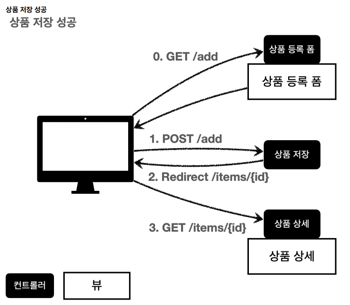
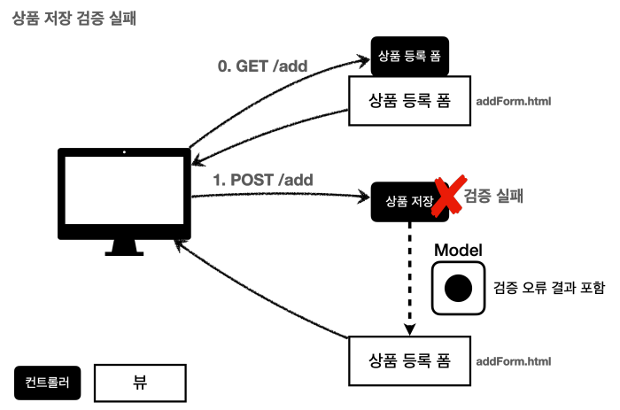
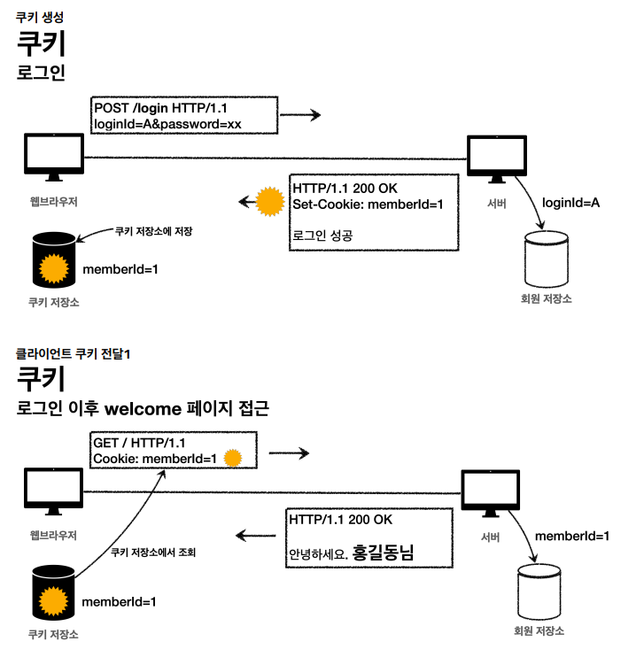
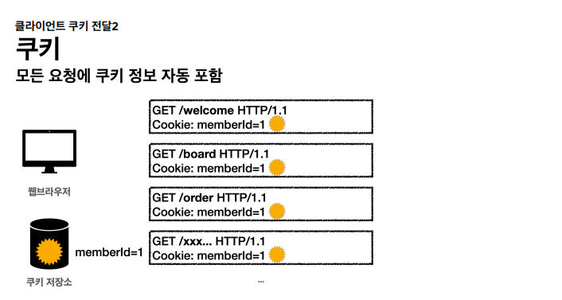
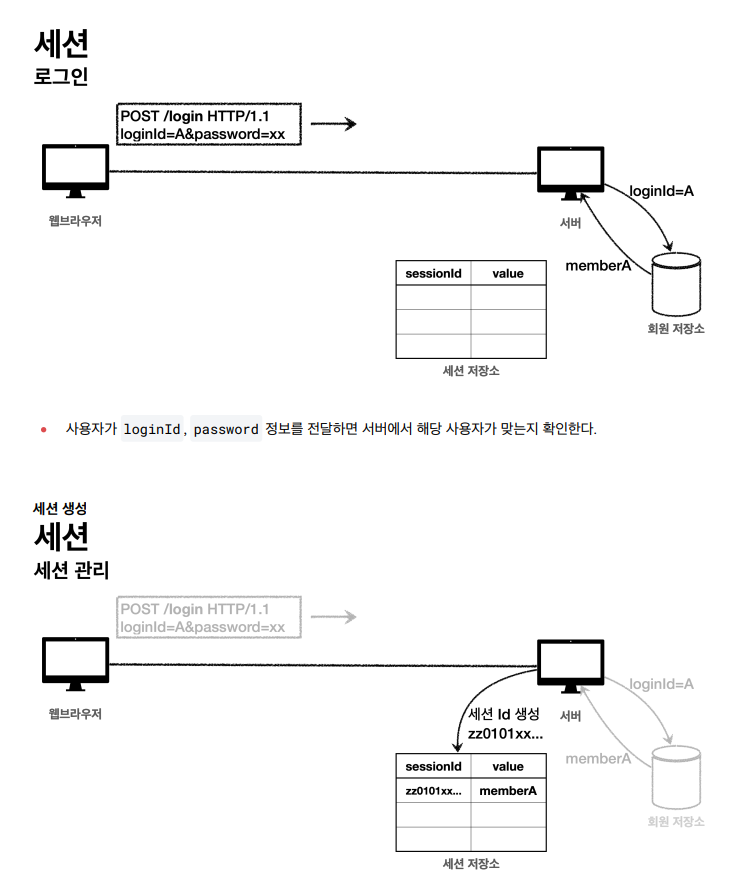
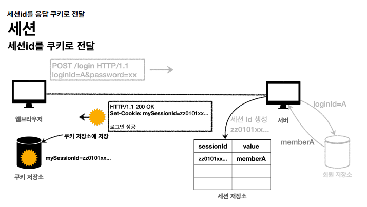
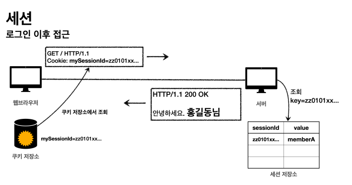
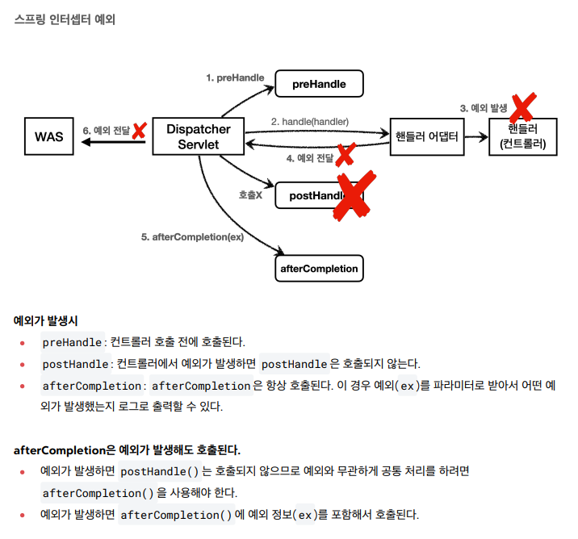

# 스프링 MVC 2편 - 백엔드 웹 개발 활용 기술

## 1. 타임리프 기본 기능

### 타임리프 소개
Thymeleaf는 웹과 독립형 환경 모두를 위한 최신 서버 사이드 Java 템플릿 엔진이다.

Tymeleaf의 주요 목표는 개발 워크플로우에 우아하고 자연스러운 템플릿을 제공하는 것이다.

즉, 브라우저에서 올바르게 표시될 수 있고 정적 프로토타입으로도 작동하는 HTML을 제공하여 개발팀에서 더욱 긴밀한 협업을 가능하게 한다.

Spring Framework용 모둘과 즐겨쓰는 도구와의 다양한 통합 기능, 그리고 사용자가 직접 만든 기능을 플러그인으로 추가할 수 있는 기능을 갖춘 
Thymeleaf는 최신 HTML5 JVM웹 개발에 이상적이다.

### 타임리프 특징
- 서버 사이드 HTML 렌더링 (SSR)
  - 타임리프는 백엔드 서버에서 HTML을 동적으로 렌더링 하는 용도로 사용된다.
- 네츄럴 템플릿
  - 타임리프로 작성한 파일은 HTML을 유지하기 때문에 웹 브라우저에서 파일을 직접 열어도 내용을 확인할 수 있고, 서버를 통해 뷰 템플릿을 거치면 동적으로 변경된 결과를 확인할 수 있다.
- 스프링 통합 지원
  - 타임리프는 스프링과 자연스럽게 통합되고, 스프링의 다양한 기능을 편리하게 사용할 수 있게 지원한다.

### 타임리프 기본 기능
- 타임리프 사용 선언: \<html xmlns:th="http://www.thymeleaf.org">
- 기본 표현식(간단한 표현)
  - 변순 표현식: ${...}
  - 선택 변수 표현식: *{...}
  - 메시지 표현식: #{...}
  - 링크 URL 표현식: @{...}
  - 조각 표현식: ~{...}
- 기본 표힌식(리터럴)
  - 텍스트: 'text'
  - 숫자: 0, 1, 2
  - 불린: true, false
  - 널: null
  - 리터럴 토큰: one, sometext
- 기본 표현식(문자 연산)
  - 문자 합치기: +
  - 리터럴 대체: |The name is ${name}|
- 기본 표현식(산술 연산)
  - Binary operators: +, -, *, /, %
  - Minus sign(unary operator): -
- 기본 표현식(불린 연산)
  - Binary operators: and, or
  - Boolean negation(unary operator): !, not
- 기본 표현식(비교와 동등)
  - 비교: >, <, >=, <= (gt, lt, ge, le)
  - 동등연산: ==, != (eq ne)
- 기본 표현식(조건 연산)
  - If-then: (if) ? (then)
  - If-then-else: (if) ? (then) : (else)
  - Default: (value) ?: (defaultValue)
- 기본 표현식(특별한 토큰)
  - No-Operation: _

### 텍스트 - text, utext
타입리프의 가장 기본 기능인 텍스트를 출력하는 기능
- HTML의 콘텐츠에 데이터를 출력하는 경우
  - `th:text`
  - `<span th:text="${data}">`
- HTML 태그 속성이 아닌 HTML 콘텐츠 영역안에 직접 데이터 출력
  - `[[...]]`
  - `[[$data]]`
#### Escape
타임리프가 제공하는 `th:text`, `[[...]]` 는 기본적으로 이스케이프를 제공한다.
#### Unescape
이스케이프 기능을 사용하지 않으려면 `th:utext`, `[(...)]`을 사용한다.

### 변수 - SrpingEL
타임리프에서 변수를 사용할 때는 변수 표현식을 사용한다. `${...}`
- SpringEL 다양한 표현식 사용 (user, users, userMap)
  - Object
    - user.username
    - user['username']
    - user.getUsername
  - List
    - users[0].username
    - users[0]['username']
    - users[0].getUsername
  - Map
    - userMap['userA'].username
    - userMap['userA'].['username']
    - userMap['userA'].getUsername()

#### 지역 변수 선언
`th:with`를 사용하면 지역 변수를 선언해서 사용할 수 있다. `th:with="first=${users[0}"`

### 기본 객체들
타임리프는 기본 객체들을 제공한다.
- ${#request} - 스프링 부트 3.0부터 제공하지 않는다.
- ${#response} - 스프링 부트 3.0부터 제공하지 않는다.
- ${#session} - 스프링 부트 3.0부터 제공하지 않는다.
- ${#servletContext} - 스프링 부트 3.0부터 제공하지 않는다.
- ${#locale}

###  유틸리티 객체와 날짜
타임리프는 문자, 숫자, 날짜, URI 등을 편리하게 다루는 다양한 유틸리티 객체를 제공한다.
* #message : 메시지, 국제화 처리
* #uris : URI 이스케이프 지원
* #dates : java.util.Date 서식 지원
* #calendars : java.util.Calendar 서식 지원
* #temporals : 자바8 날짜 서식 지원
* #numbers : 숫자 서식 지원
* #strings : 문자 관련 편의 기능
* #objects : 객체 관련 기능 제공
* #bools : boolean 관련 기능 제공
* #arrays : 배열 관련 기능 제공
* #lists , #sets , #maps : 컬렉션 관련 기능 제공
* #ids : 아이디 처리 관련 기능 제공, 뒤에서 설명

### URL 링크
타임리프에서 URL을 생성할 때는 `@{...}` 문법을 사용한다.
- 단순한 URL: `@{/hello}` -> `/hello`
- 쿼리 파라미터
  - `@{/hello(param1=${param1}, param2=${param2})}` -> `/hello?param1=data1&param2=data2`
  - `()`에 있는 부분은 쿼리 파라미터로 처리된다.
- 경로 변수
  - `@{/hello/{param1}/{param2}(param1=${param1}, param2=${param2})}` -> `/hello/data1/data2`
  - URL 경로상 변수가 있으면 `()`부분은 경로 변수로 처리된다.
- 경로 변수 + 쿼리 파라미터
  - `@{/hello/{param1}(param1=${param1}, param2=${param2})}` -> `/hello/data1?param2=data2`
  - 경로 변수와 쿼리 파라미터를 함꺼ㅔ 사용할 수 있다.

### 리터럴
리터럴은 소스 코드상에 고정된 값을 말하는 용어이다.
문자 리터럴은 원칙상 ' 로 감싸야 한다. 중간에 공백이 있어서 하나의 의미있는 토큰으로도 인식되지 않는다.
* 문자: 'hello'
* 숫자: 10
* 불린: true , false
* null: null

### 연산
타임리프의 연산은 자바와 크게 다르지 않다. HTML안에서 사용하기 때문에 HTML 엔티티를 사용하는 부분만 주의하면 좋다.

### 속성값 설정
타임리프는 주로 HTML 태그에 `th:*` 속성을 지정하는 방식으로 동작한다.

`th:*`로 속성을 적용하면 기존 속성을 대체한다. 기존 속성이 없으면 새로 만든다.

- 속성 추가
  - `th:attrappend` : 속성 값의 뒤에 값을 추가한다.
  - `th:attrprepend` : 속성 값의 앞에 값을 추가한다.
  - `th:classappend` : class 속성에 자연스럽게 추가한다
- checked 처리
  - HTML에서 `checked=false`인 경우에도 checked 속성이 있기 때문에 checked 처리가 되어버린다.
  - 이런 부분에서 `true`,`false` 값을 주로 사용하는 개발자 입장에서는 불편하다.
  - 타임리프의 `th:checked`는 값이 `false`인 경우 속성 자체를 제거한다.

### 반복
타임리프에서 반복은 `th:each`를 사용한다.
- `<tr th:each="user : ${users}">`
- 반복의 두번째 파라미터를 설정해서 반복의 상태를 확인할 수 있다.
  - `<tr th:each="user, userStat : ${users}">`
  - 두번째 파라미터는 생략 가능한데 생략하면 지정한 변수명 + Stat 으로 지정된다.
  - index : 0부터 시작하는 값
  - count : 1부터 시작하는 값
  - size : 전체 사이즈
  - even , odd : 홀수, 짝수 여부( boolean )
  - first , last :처음, 마지막 여부( boolean )
  - current : 현재 객체

### 조건부 평가
타임 리프의 조건식 `th:if`, `th:unless`, `th:switch`, `th:case="*"`

타임리프는 해당 조건이 맞지 않으면 태그 자체를 렌더링 하지 않는다.

### 주석
1. 표준 HTML 주석 `<!-- -->`: 표준 HTML 주석은 타임리프가 렌더링 하지 않고 그대로 남겨둔다.
2. 타임리프 파서 주석 `<!--/* */-->`: 타임리프 파서 주석은 타임리프의 진짜 주석이다. 렌더링에서 주석 부분을 제거한다.
3. 타임리프 프로토타입 주석 `<!--/*/ /*/-->`: HTML파일을 그대로 열면 렌더링하지 않고 타임리프 렌더링을 거치면 정상 렌더링 된다.

### 블록
`th:block`은 HTML 태그가 아닌 타임리프의 유일한 자체 태그다. 렌더링시 제거된다.

### 자바스크립트 인라인
타임리프는 자바 스크립트에서 타임리프를 편리하게 사용할 수 있는 자바 스크립트 인라인 기능을 제공한다.

`<script th:inline="javascript">`

#### 텍스트 렌더링
인라인 사용하면 문자타입인 경우 `"`를 포함해준다. 추가로 자바스크립트에서 문제가 될 수 있는 문자가 포함되어 있으면 이스케이프 처리도 해준다.

#### 자바스크립트 내추럴 템플릿
타임리프는 HTML 파일을 직접 열어도 동작하는 네추럴 템플릿 기능을 제공한다. 자바스크립트 인라인 기능을 사용하면 주석을 활용해서 이 기능을 사용할 수 있다.
인라인 사용하지 않으면 정말 순수하게 그대로 해석을 해버려 내추럴 템플릿 기능이 동작하지 않는다.

#### 객체
타임리프의 자바스크립트 인라인 기능을 사용하면 객체를 JSON으로 자동 변환해준다.

### 템플릿 조각, 레이아웃
웹 페이지를 개발할 때는 공통 영역이 많이 있다. 예를 들어서 상단 영역이나 하단 영역, 좌측 카테고리 등등 여러 페이지에서 함께 사용하는 영역들이 있다.
이런 부분을 복사해서 사용한다면 변경시 여러 페이지를 다 수정해야 하므로 상당히 비효율 적이다. 타임리프는 문제 해결을 위해 템플릿 조각과 레이아웃 기능을 지원한다.

## 2. 타임리프 - 스프링 통합과 폼

### 타임리프 스프링 통합
타임리프는 스프링 없이도 동작하지만, 스프링 통합을 위한 다양한 기능을 편리하게 제공한다. 
그리고 이런 부분은 스프링으로 백엔드를 개발하는 개발자 입장에서 타임리프를 선택하는 하나의 이유가 된다.

#### 스프링 통합으로 추가되는 기능들
* 스프링의 SpringEL 문법 통합
* ${@myBean.doSomething()} 처럼 스프링 빈 호출 지원
* 편리한 폼 관리를 위한 추가 속성
  * th:object (기능 강화, 폼 커맨드 객체 선택)
  * th:field , th:errors , th:errorclass
* 폼 컴포넌트 기능
  * checkbox, radio button, List 등을 편리하게 사용할 수 있는 기능 지원
* 스프링의 메시지, 국제화 기능의 편리한 통합
* 스프링의 검증, 오류 처리 통합
* 스프링의 변환 서비스 통합(ConversionService)

#### 설정 방법
타임리프 템플릿 엔진을 스프링 빈에 등록하고, 타임리프용 뷰 리졸버를 스프링 빈으로 등록하면 된다.

스프링 부트는 이런 부분 모두 자동화 해준다. `build.gradle`에 `implementation 'org.springframework.boot:spring-boot-starter-thymeleaf'`
넣어주면 Gradle은 타임리프와 관련된 라이브러리를 다운로드 받고, 자동으로 등록해준다.

타임리프 관련 설정을 변경하고 싶으면 `application.properties`에 추가하여 변경하면 된다.

### 입력 폼 처리
타임리프가 제공하는 입력 폼 기능을 적용하면 폼 코드를 타임리프가 지원하는 기능을 사용해서 효율적으로 개선할 수 있다.
* `th:object`: 커맨드 객체를 지정한다.
* `*{...}`: 선택 변수 식이라고 한다. th:object 에서 선택한 객체에 접근한다.
* `th:field`
  * HTML 태그의 id , name , value 속성을 자동으로 처리해준다.

#### 렌더링 전
`<input type="text" th:field="*{itemName}" />`

#### 렌더링 후
`<input type="text" id="itemName" name="itemName" th:value="*{itemName}" />`

### 체크 박스 - 단일
HTML에서 체크 박스를 선택하지 않고 폼을 전송하면 필드 자체가 서버로 전송되지 않는다.

체크 해제를 인식하기 위한 히든 필드를 추가한다.
`<input type="hidden" name="_open" value="on"/>`

```html
<!-- single checkbox -->
<div>판매 여부</div>
<div>
   <div class="form-check">
     <input type="checkbox" id="open" name="open" class="form-check-input">
     <input type="hidden" name="_open" value="on"/> <!-- 히든 필드 추가 -->
     <label for="open" class="form-check-label">판매 오픈</label>
   </div>
</div>
```

체크 박스를 체크하면 스프링 MVC가 `open`에 값이 있는 것을 확인하고 `_open`은 무시한다.

체크 박스를 체크하지 않으면 스프링 MVC가 `_open`만 있는 것을 확인하고 `open`의 값이 체크되지 않았다고 인식한다.

이 경우 서버에서 결과가 `null`이 아니라 `false`인 것을 확인할 수 있다.

개발할 때마다 이렇게 필드를 추가하는 것은 상당히 번거롭기 때문에 타임리프가 제공하는 폼 기능을 사용하면 이런 부분을 자동으로 처리할 수 있다.
```html
<!-- single checkbox -->
<div>판매 여부</div>
<div>
  <div class="form-check">
    <input type="checkbox" id="open" th:field="*{open}" class="form-checkinput">
    <label for="open" class="form-check-label">판매 오픈</label>
  </div>
</div>
```
HTML을 생성하게 되면 히든 필드 부분을 자동으로 생성해준다.

### 체크 박스 - 멀티

#### @ModelAttribute
`@ModelAttribute` 어노테이션은 컨트롤러에 있는 별도의 메서드에 적용할 수 있다.
이렇게 하면 해당 컨트롤러 요청할 때 세팅되어 있는 값이 자동으로 모델에 담기게 된다.

```html
<!-- multi checkbox -->
<div>
 <div>등록 지역</div>
 <div th:each="region : ${regions}" class="form-check form-check-inline">
   <input type="checkbox" th:field="*{regions}" th:value="${region.key}" class="form-check-input">
   <label th:for="${#ids.prev('regions')}" th:text="${region.value}" class="form-check-label">서울</label>
 </div>
</div>
```
`th:for="${#ids.prev('regions')}"`
멀티 체크박스는 같은 이름의 여러 체크박스를 만든다. HTML 태그 속성에서 `name`은 같아도 되지만 `id`는 모두 달라야 한다.
따라서 타임리프는 체크박스를 `each` 루프 안에서 반복할 때는 임의로 `1,2,3` 숫자를 뒤에 붙여준다.

### 라디오 버튼
```html
<!-- radio button -->
<div>
 <div>상품 종류</div>
 <div th:each="type : ${itemTypes}" class="form-check form-check-inline">
   <input type="radio" th:field="*{itemType}" th:value="${type.name()}" class="form-check-input">
   <label th:for="${#ids.prev('itemType')}" th:text="${type.description}" class="form-check-label">
   BOOK</label>
 </div>
</div>
```
위 코드에서, `th:field="*{itemType}"`를 설정하면 Spring MVC에서 `itemType`에 저장된 값과 일치하는 radio 버튼이 자동으로 선택됩니다.

### 셀렉트 박스
```html
```html
<!-- SELECT -->
<div>
 <div>배송 방식</div>
    <select th:field="*{deliveryCode}" class="form-select">
    <option value="">==배송 방식 선택==</option>
    <option th:each="deliveryCode : ${deliveryCodes}" th:value="${deliveryCode.code}" th:text="${deliveryCode.displayName}">FAST</option>
    </select>
</div>
```

## 3. 메시지, 국제화

### 소개

#### 메시지
'상품명'이라는 단어를 모두 '상품이름'으로 고쳐달라고 하면 어떻게 해야할까?
여러 화면에 보이는 상품명이 하드코딩 되어 있다면 모든 화면을 찾아가서 변경을 해야한다.
이런 다양한 메시지를 한 곳에서 관리하도록 하는 기능을 메시지 기능이라고 한다.

`messages.properties`라는 메시지 관리용 파일을 만들고 각 HTML들은 해당 데이터를 key 값으로 불러서 사용하는 방식이다.
```html
-- messages.properties
item=상품
item.id=상품 ID
item.itemName=상품명
item.price=가격
item.quantity=수량

-- HTML
<label for="itemName" th:text="#{item.itemName}"></label>
<label for="itemName" th:text="#{item.itemName}"></label>
```
#### 국제화
메시지에서 한달 더 나아가 메시지에서 설명한 메시지 파일을 각 나라별로 별도록 관리하면 서비스를 국제화 할 수 있다.
```
-- messages_en.properties
item=Item
item.id=Item ID
item.itemName=Item Name
item.price=price
item.quantity=quantity

-- messages_ko.properties
item=상품
item.id=상품 ID
item.itemName=상품명
item.price=가격
item.quantity=수량
```
이렇게 하면 간편하게 사이트를 국제화 할 수 있다.
한국에서 접근한 것인지 영어에서 접근한 것인지 인식하는 방법은 HTTP `accept-language` 헤더 값을 사용하거나
사용자가 직접 언어를 선택하도록 하고, 쿠키 등을 사용해서 처리할 수 있다.


메시지와 국제화 기능을 직접 구현할 수도 있겠지만, 스프링은 기본적으로 메시지와 국제화 기능을 모두 제공한다.
그리고 타임리프도 스프링이 제공하는 메시지와 국제화 기능을 편리하게 통합해서 제공한다.


### 스프링 메시지 소스 설정
메시지 관리 기능을 사용하려면 스프링이 제공하는 `MessageSource`를 스프링 빈으로 등록하면 되는데
`MessageSource`는 인터페이스이다. 따라서 구현체인 `ResourceBundleMessageSource`를 스프링 빈으로 등록하면 된다.

#### 직접 등록

```java

@Bean
public MessageSource messageSource() {
  ResourceBundleMessageSource messageSource = new ResourceBundleMessageSource();
  messageSource.setBasenames("messages", "errors");
  messageSource.setDefaultEncoding("utf-8");
  return messageSource;
}
```
- `basenames`: 설정 파일의 이름을 지정한다. 
  - 추가로 국제화 기능을 적용하려면 파일명 마지막에 언어 정보`_ko`, `_en` 등을 주면된다.
  - 만약 찾을 수 있는 국제화 파일이 없으면 `messages.properties`를 기본으로 사용한다.  

#### 스프링 부트
스프링 부트를 사용하면 스프링 부트가 `MessageSource`를 자동으로 스프링 빈으로 등록한다.

스프링 부트를 사용하면 다음과 같이 메시지 소스를 설정할 수 있다.
```
-- application.properties
1. 스프링 부트 메시지 소스 설정
spring.messages.basename=messages,config.i18n.messages
2. 스프링 부트 메시지 소스 기본 값
spring.messages.basename=messages
```
`MessageSource`를 스프링 빈으로 등록하지 않고 스프링 부트와 관련된 별도의 설정을 하지 않으면
`messages`라는 이름으로 기본 등록된다. 따라서 `messages_en.properties`, `messages_ko.properties`, `messages.properties` 파일만 등록하면 자동으로 인식된다.

### 스프링 메시지 소스 사용

#### MessageSource 인터페이스
```java
public interface MessageSource {
  String getMessage(String code, @Nullable Object[] args, @Nullable String
          defaultMessage, Locale locale);
  String getMessage(String code, @Nullable Object[] args, Locale locale)
          throws NoSuchMessageException;
}
```
인터페이스를 보면 코드를 포함한 일부 파라미터로 메시지를 읽어오는 기능을 제공한다.

#### 국제화 파일 선택
locale 정보를 기반으로 국제화 파일을 선택한다.
- `Locale`이 `en_US`의 경우 다음 순서로 찾는다.
  1. `messages_en_US`
  2. `messages_en`
  3. `messages`
- `Locale`에 맞추어 구체적인 것이 있으면 구체적인 것을 찾고, 없으면 디폴트를 찾는다고 이해하면 된다.
- `Locale` 정보가 없는 경우 `Locale.getDefault()` 을 호출해서 시스템의 기본 로케일을 사용합니다.

### 스프링의 국제화 메시지 선택
메시지 기능은 `Locale` 정보를 알아야 언어를 선택할 수 있다.
결국 스프링도 `Locale` 정보를 알아야 언어를 선택할 수 있는데, 스프링은 언어 선택시 기본으로 `Accept-Language` 헤더의 값을 사용한다.

#### LocaleResolver
스프링은 `Locale` 선택 방식을 변경할 수 있도록 `LocaleResolver` 라는 인터페이스를 제공한다.
스프링 부트는 기본으로 `Accept-Language`를 활용하는 `AcceptHeaderLocaleResolver`를 사용한다.

#### LocaleResolver 인터페이스
```java
public interface LocaleResolver {
    Locale resolveLocale(HttpServletRequest request);
    void setLocale(HttpServletRequest request, @Nullable HttpServletResponse
          response, @Nullable Locale locale);
}
```
#### LocaleResolver 변경
만약 `Locale` 선택 방식을 변경하려면 `LocaleResolver`의 구현체를 변경해서 쿠키나 세션 기반의 선택 기능을 사용할 수 있다.
예를 들어 고객이 직접 `Locale`을 선택하도록 하는 것이다. 관련한 내용은 검색을 통해 수 많은 예제가 나오니 참고하자.

## 4. 검증 - Validation

지금까지 만든 웹 애플리케이션은 폼 입력시 숫자를 문자로 작성하거나해서 검증 오류가 발생하면
오류 화면으로 바로 이동한다. 이렇게 되면 사용자는 처음부터 해당 폼으로 다시 이동해서 입력을 해야 한다.
이런 서비스라면 사용자는 금방 모두 떠나버릴 것이다. 웹 서비스는 오류가 발생하면, 고객에게 어떤 오류가 발생햇는지 친절하게 알려주어야 한다.

**컨트롤러의 중요한 역할 중 하나는 HTTP 요청이 정상인지 검증하는 것이다.** 
그리고 정상 로직보다 이런 검증 로직을 잘 개발하는 것이 어쩌면 더 어려울 것이다.

#### 참고: 클라이언트 검증, 서버 검증
- 클라이언트 검증은 조작할 수 있으므로 보안에 취약하다.
- 서버만으로 검증하면, 즉각적인 고객 사용성이 부족해진다.
- 둘을 적절히 섞어서 사용하되, 최종적으로 서버 검증은 필수이다.
- API 방식을 사용하면 API 스펙을 잘 정의해서 검증 오류를 API 응답 결과에 잘 남겨주어야 한다.

### 검증 직접 처리 - 소개


고객이 상품 등록 폼에서 검증 범위를 넘어서면, 서버 검증 로직이 실패해야 한다.
이렇게 검증에 실패한 경우 고객에게 다시 상품 등록 폼을 보여주고, 어떤 값을 잘못 입력했는지 친절하게 알려주어야 한다.

### 검증 직접 처리 - 개발

```java
//검증 오류 결과를 보관
Map<String, String> errors = new HashMap<>();

//검증 로직
if (!StringUtils.hasText(item.getItemName())) {
        errors.put("itemName", "상품 이름은 필수입니다.");
}

//복합 검증 로직
if (item.getPrice() != null && item.getQuantity() != null) {
    int resultPrice = item.getPrice() * item.getQuantity();
    if (resultPrice < 10000) {
        errors.put("globalError", "가격 * 수량의 합은 10,000원 이상이어야 합니다. 현재 값 = " + resultPrice);
    }
}

//검증 실패
if (!errors.isEmpty()) {
    model.addAttribute("errors", errors);
    return "validation/v1/addForm";
}

//검증 성공
Item savedItem = itemRepository.save(item);
redirectAttributes.addAttribute("itemId", savedItem.getId());
redirectAttributes.addAttribute("status", true);
return "redirect:/validation/v1/items/{itemId}";
```
#### 정리
- 만약 검증 오류가 발생하면 입력 폼을 다시 보여준다.
- 검증 오류들을 고객에게 친절하게 안내해서 다시 입력할 수 있게 한다.
- 검증 오류가 발생해도 고객이 입력한 데이터가 유지된다.

#### 남은 문제점
- 뷰 템플릿에 중복 처리가 많다.
- 타입 오류 처리가 안된다. 숫자 필드는 타입이 `Integer`이므로 문자 타입으로 설정하는 것이 불가능하다. 그런데 이러한 오류는 스프링 MVC에서 컨트롤러에 진입하기도 전에 예외가 발생하기 때문에, 컨트롤러가 호출되지도 않고, 400 예외가 발생하면서 오류 페이지를 띄워준다.
- 타입 오류가 발생해도 고객이 입력한 문자를 화면에 남겨야 한다.
- 결국 고객이 입력한 값도 어딘가에 별도로 관리가 되어야 한다.

### BindingResult1
스프링이 제공하는 검증 오류 처리 방법을 알아보자.
핵심은 `BindingResult`이다.

우선 코드로 확인을 해보자.
```java
public String addItemV1(@ModelAttribute Item item, BindingResult bindingResult,
                        RedirectAttributes redirectAttributes) {
    //검증 로직
  if (!StringUtils.hasText(item.getItemName())) {
    bindingResult.addError(new FieldError("item", "itemName", "상품 이름은 필수입니다."));\
    
   //복합 검증 로직 
    if (item.getPrice() != null && item.getQuantity() != null) {
      int resultPrice = item.getPrice() * item.getQuantity();
      if (resultPrice < 10000) {
        bindingResult.addError(new ObjectError("item", "가격 * 수량의 합은
                10,000원 이상이어야 합니다. 현재 값 = " + resultPrice));
      }
    }
    
    //검증 실패
    if (bindingResult.hasErrors()) {
      log.info("errors={}", bindingResult);
      return "validation/v2/addForm";
    }
    
    //검증 성공
    Item savedItem = itemRepository.save(item);
    redirectAttributes.addAttribute("itemId", savedItem.getId());
    redirectAttributes.addAttribute("status", true);
    return "redirect:/validation/v2/items/{itemId}";
}
```
#### FieldError 생성자 요약
```java
public FieldError(String objectName, String field, String defaultMessage) {}
```
#### 글로벌 오류 - ObjectError 생성자 요약
```java
public ObjectError(String objectName, String defaultMessage) {}
```
특정 필드를 넘어서는 오류가 있으면 `ObjectError` 객체를 생성해서 `bindingResult`에 담아두면 된다.
- `objectName`: @ModelAttribute의 이름
- `defaultMessage`: 오류 기본 메시지

### BindingResult2
- 스프링이 제공하는 검증 오류를 보관하는 객체이다. 검증 오류가 발생하면 여기에 보관하면 된다.
- `BindingResult`가 있으면 `@ModelAttribute`에 데이터 바인딩 시 오류가 발생해도 컨트롤러가 호출된다.(타입 오류 해결)

#### BindingResult에 검증 오류를 적용하는 3가지 방법
- `@ModelAttribute`의 객체에 타입 오류 등으로 바인딩이 실패하는 경우 스프링이 `FieldError` 생성해서 `BindingResult`에 넣어준다.
- 개발자가 직접 넣어준다.
- `Validator` 사용

`BindingResult`는 인터페이스이고, `Error` 인터페이스를 상속받고 있다.

실제 넘어오는 구현체는 `BeanPropertyBindingResult`라는 것인데, 둘다 구현하고 있으므로 둘다 사용이 가능하다.

`Error` 인터페이스는 단순한 오류 저장과 조회 기능을 제공하고 `BindingResult`는 여기에 더해서 추가적인 기능들을 제공한다.
`addError()`도 `BindingResult`가 제공하므로 여기서는 `BindingResult`를 사용하자. 주로 관례상 `BindingResult`를 많이 사용한다.

### FieldError, ObjectError

#### FiledError 생성자
```java
public FieldError(String objectName, String field, String defaultMessage);
public FieldError(String objectName, String field, @Nullable Object
rejectedValue, boolean bindingFailure, @Nullable String[] codes, @Nullable
Object[] arguments, @Nullable String defaultMessage)
```
* `objectName` : 오류가 발생한 객체 이름
* `field` : 오류 필드
* `rejectedValue` : 사용자가 입력한 값(거절된 값)
* `bindingFailure` : 타입 오류 같은 바인딩 실패인지, 검증 실패인지 구분 값
* `codes` : 메시지 코드
* `arguments` : 메시지에서 사용하는 인자
* `defaultMessage` : 기본 오류 메시지

`ObjectError`도 유사하게 두 가지 생성자를 제공한다.

### 오류 코드와 메시지 처리1
`FieldError`, `ObjectError`의 생성자는 `code`,`argument`를 제공한다.
오류 메시지를 체계적으로 다루기 위해서 오류 발생시 오류코드로 메시지를 찾기 위해 사용된다.

`messages.properties`를 사용해도 되지만, 오류 메시지를 구분하기 쉽게 `errors.properties`라는 별도의 파일로 관리한다.

#### 사용 예시
```java
//range.item.price=가격은 {0} ~ {1} 까지 허용합니다.
new FieldError("item", "price", item.getPrice(), false, new String[]
    {"range.item.price"}, new Object[]{1000, 1000000})
```

실행해보면 메시지, 국제화에서 학습한 `MessageSource`를 찾아서 메시지를 조회하는 것을 확인할 수 있다.

### 오류 코드와 메시지 처리2
`FieldError`, `ObjectError`는 다루기 너무 번거로운데 오류 코드도 좀 더 자동화 할 수 있지 않을까?

컨트롤러에서 `BindingResult`는 검증해야 할 객체인 `target` 바로 다음에 온다. 
따라서 `BindingResult`는 이미 본인이 검증해야 할 객체인 `target`을 알고 있다.

#### rejectValue(), reject()
`BindingResult` 가 제공하는 `rejectValue()`, `reject()` 를 사용하면 `FieldError`, `ObjectError` 를 직
접 생성하지 않고, 깔끔하게 검증 오류를 다룰 수 있다.

#### rejectValue(), reject()
```java
void rejectValue(@Nullable String field, String errorCode,
    @Nullable Object[] errorArgs, @Nullable String defaultMessage);

void reject(String errorCode, @Nullable Object[] errorArgs, @Nullable String
    defaultMessage);

bindingResult.rejectValue("price", "range", new Object[]{1000, 1000000}, null)
```
* `field` : 오류 필드명
* `errorCode` : 오류 코드(이 오류 코드는 메시지에 등록된 코드가 아니다. 뒤에서 설명할 messageResolver를 위한 오류 코드이다.)
* `errorArgs` : 오류 메시지에서 {0} 을 치환하기 위한 값
* `defaultMessage` : 오류 메시지를 찾을 수 없을 때 사용하는 기본 메시지

#### 축약된 오류 코드
`FieldError()`를 직접 다룰 때는 오류코드를 `range.item.price`와 같이 모두 입력했다.
그런데 `rejectValue()`를 사용하고 부터는 오류 코드를 `range`로 간단하게 입력했다.
그래도 오류 메시지를 잘 찾아서 출력한다. 무언가 규칙이 존재한다. 이 부분을 이해하려면 `MessageCodesResolver`를 이해해야 한다.

### 오류 코드와 메시지 처리3
오류 코드를 만들 때 다음과 같이 자세히 만들 수도 있다.
```
required.item.itemName: 상품 이름은 필수 입니다.
range.item.price: 상품의 가격 범위 오류 입니다.
```
또는 다음과 같이 단순하게 만들 수도 있다.
```
required : 필수 값 입니다.
range : 범위 오류 입니다.
```

단순하게 만들면 범용성이 좋아서 여러곳에서 사용할 수 있지만, 메시지를 세밀하게 작성하기 어렵다.
반대로 너무 자세하게 만들면 범용성이 떨어진다. 가장 좋은 방법은 범용성으로 사용하다가, 세밀하게 작성해야 하는 경우에는
세밀한 내용이 적용되도록 메시지에 단계를 두는 방법이다.

스프링은 `MessageCodesResolver` 라는 것으로 이러한 기능을 지원한다.

### 오류 코드와 메시지 처리4
```
#Level1
required.item.itemName: 상품 이름은 필수 입니다.

#Level2
required: 필수 값 입니다.
```
#### MessageCodesResolver
- 검증 오류 코드로 메시지 코드들을 생성한다.
- `MessageCodesResolver` 인터페이스이고 `DefaultMessageCodesResolver`는 기본 구현체이다.
- 주로 다음과 함계 사용한다. `OjbectError`, `FieldError`

#### DefaultMessageCodesResolver의 기본 메시지 생성 규치
```
- 객체 오류
객체 오류의 경우 다음 순서로 2가지 생성
1.: code + "." + object name
2.: code

예) 오류 코드: required, object name: item
1.: required.item
2.: required

- 필드 오류
필드 오류의 경우 다음 순서로 4가지 메시지 코드 생성
1.: code + "." + object name + "." + field
2.: code + "." + field
3.: code + "." + field type
4.: code

예) 오류 코드: typeMismatch, object name: "user", field: "age", field type: int
1. "typeMismatch.user.age"
2. "typeMismatch.age"
3. "typeMismatch.int"
4. "typeMismatch"
```
타임리프 화면을 렌더링 할 때 `th:errors`가 실행된다.
만약 이때 오류가 있다면 생성된 오류 메시지 코드를 순서대로 돌아가면서 메시지를 찾는다. 
그리고 없으면 디폴트 메시지를 출력한다.

### 오류 코드와 메시지 처리5

####오류 코드 관리 전략
**핵심은 구체적인 것에서! 덜 구체적인 것으로!**

`MessageCodesResolver` 는 `required.item.itemName` 처럼 구체적인 것을 먼저 만들어주고, `required` 처
럼 덜 구체적인 것을 가장 나중에 만든다.
이렇게 하면 앞서 말한 것 처럼 메시지와 관련된 공통 전략을 편리하게 도입할 수 있다

**왜 이렇게 복잡하게 사용하는가?**

모든 오류 코드에 대해서 메시지를 각각 다 정의하면 개발자 입장에서 관리하기 너무 힘들다.
크게 중요하지 않은 메시지는 범용성 있는 `requried` 같은 메시지로 끝내고, 정말 중요한 메시지는 꼭 필요할 때 구체
적으로 적어서 사용하는 방식이 더 효과적이다.

### 오류 코드와 메시지 처리6

#### 스프링이 직접 만든 오류 메시지 처리
검증 오류 코드는 다음과 같이 2가지로 나눌 수 있다.
- 개발자가 직접 설정한 오류 코드 -> `rejectValue()`를 직접 호출
- 스프링이 직접 검증 오류에 추가한 경우(주로 타입 정보가 맞지 않음)

`Integer` 필드에 문자 `"A"`를 입력하면 `BindingResult`에 `FieldError`가 담겨있다.
다음과 같은 메시지 코드들이 생성된 것을 확인할 수 있다.
`codes[typeMismatch.item.price,typeMismatch.price,typeMismatch.java.lang.Integer,ty
peMismatch]`

다음과 같이 4가지 메시지 코드가 입력되어 있다.
* `typeMismatch.item.price`
* `typeMismatch.price`
* `typeMismatch.java.lang.Integer`
* `typeMismatch`

위와 같은 코드를 이용해서 `errors.properteis`에 추가한다.
```
#추가
typeMismatch.java.lang.Integer=숫자를 입력해주세요.
typeMismatch=타입 오류입니다.
```
결과적으로 소스코드를 하나도 건들지 않고, 원하는 메시지를 단계별로 설정할 수 있다.

### Validator 분리1
컨트롤러에서 검증 로직이 차지하는 부분은 매우 크다. 이런 경우 별도의 클래스로 역할을 분리하는 것이 좋다.
그리고 이렇게 분리한 검증 로직을 재사용할 수도 있다.

**예시**
```java
package hello.itemservice.web.validation;
import hello.itemservice.domain.item.Item;
import org.springframework.stereotype.Component;
import org.springframework.validation.Errors;
import org.springframework.validation.ValidationUtils;
import org.springframework.validation.Validator;

@Component
public class ItemValidator implements Validator {
  @Override
  public boolean supports(Class<?> clazz) {
    return Item.class.isAssignableFrom(clazz);
  }
  @Override
  public void validate(Object target, Errors errors) {
    Item item = (Item) target;
    ValidationUtils.rejectIfEmptyOrWhitespace(errors, "itemName", "required");
    if (item.getPrice() == null || item.getPrice() < 1000 || item.getPrice() > 1000000) {
        errors.rejectValue("price", "range", new Object[]{1000, 1000000}, null);
    }
    if (item.getQuantity() == null || item.getQuantity() > 10000) {
        errors.rejectValue("quantity", "max", new Object[]{9999}, null);
    }
    //특정 필드 예외가 아닌 전체 예외
    if (item.getPrice() != null && item.getQuantity() != null) {
        int resultPrice = item.getPrice() * item.getQuantity();
        if (resultPrice < 10000) {
            errors.reject("totalPriceMin", new Object[]{10000, resultPrice}, null);
        }
    }
  }
}
```
```java
private final ItemValidator itemValidator;

@PostMapping("/add")
public String addItemV5(@ModelAttribute Item item, BindingResult bindingResult,
RedirectAttributes redirectAttributes) {
    
  itemValidator.validate(item, bindingResult);
  
  if (bindingResult.hasErrors()) {
    log.info("errors={}", bindingResult);
    return "validation/v2/addForm";
  }
  //성공 로직
  Item savedItem = itemRepository.save(item);
  redirectAttributes.addAttribute("itemId", savedItem.getId());
  redirectAttributes.addAttribute("status", true);
  return "redirect:/validation/v2/items/{itemId}";
}
```

스프링은 검증을 체계적으로 제공하기 위해 `Validator` 인터페이스를 제공한다.
```java
public interface Validator {
  boolean supports(Class<?> clazz);
  void validate(Object target, Errors errors);
}
```
- `support() {}`: 해당 검증기를 지원하는 여부 확인
- `validate(Object target, Errors errors)`: 검증 대상 객체와 BindingResult

`ItemValidator`를 스프링 빈으로 주입 받아서 직접 호출했다.

실행해보면 기존과 완전히 동일하게 동작하는 것을 알 수 있다.

### Validator 분리2
스프링이 `Validator` 인터페이스를 별도로 제공하는 이유는 체계적으로 검증 기능을 도입하기 위해서다.
그런데 앞에서처럼 검증기를 직접 불러서 사용해도 되지만 `Validator` 인터페이스를 사용해서 검증기를 만들면 스프링의 추가적인 도움을 받을 수 있다.

#### WebDataBinder를 통해서 사용하기
`WebDataBinder`는 스프링의 파라미터 바인딩의 역할을 해주고 검증 기능도 내부에 포함한다.

```java
@InitBinder
public void init(WebDataBinder dataBinder) {
  log.info("init binder {}", dataBinder);
  dataBinder.addValidators(itemValidator);
} 
```
이렇게 `WebDataBinder`에 검증기를 추가하면 해당 컨트롤러에서는 검증기를 자동으로 적용할 수 있다.
`@InitBinder` -> 해당 컨트롤러에만 영향을 준다. 글로벌 설정은 별도로 해야한다.
validator를 직접 호출하는 부분이 사라지고, 대신에 검증 대상 앞에 `@Validated`가 붙었다.

**예시**
```java
@PostMapping("/add")
public String addItemV6(@Validated @ModelAttribute Item item, BindingResult
bindingResult, RedirectAttributes redirectAttributes) {
  if (bindingResult.hasErrors()) {
    log.info("errors={}", bindingResult);
     return "validation/v2/addForm";
  }
  //성공 로직
  Item savedItem = itemRepository.save(item);
  redirectAttributes.addAttribute("itemId", savedItem.getId());
  redirectAttributes.addAttribute("status", true);
  return "redirect:/validation/v2/items/{itemId}";
}
```

#### 글로벌 설정 - 모든 컨트롤러에 다 적용
```java
@SpringBootApplication
public class ItemServiceApplication implements WebMvcConfigurer {
  public static void main(String[] args) {
    SpringApplication.run(ItemServiceApplication.class, args);
  }
  @Override
  public Validator getValidator() {
    return new ItemValidator();
  }
}
```
이렇게 글로벌 설정을 추가할 수 있다. 기존 컨트롤러의 `@InitBinder`를 제거해도 글로벌 설정으로 정상 동작하는 것을 확인할 수 있다.

글로벌 설정을 하면 다음에 `BeanValidator`가 자동 등록되지 않는다.
글로벌 설정 부분은 주석처리 해두자. 참고로 글로벌 설정을 직접 사용하는 경우는 드물다.

#### 참고
검증시 `@Validated` `@Valid` 둘다 사용가능하다.
`javax.validation.@Valid` 를 사용하려면 `build.gradle` 의존관계 추가가 필요하다.
`implementation 'org.springframework.boot:spring-boot-starter-validation'`

`@Validated` 는 스프링 전용 검증 애노테이션이고, `@Valid` 는 자바 표준 검증 애노테이션이다.

## 5. 검증2 - Bean Validation

### Bean Validation - 소개
검증 기능을 매번 코드로 작성하는 것은 상당히 번거롭다. 
특히 특정 필드에 대한 검증 로직은 대부분 빈 값인지 아닌지, 특정 크기를 넘는지 아닌지와 같이 매우 일반적인 로직이다.

```java
public class Item {
  private Long id;
  
  @NotBlank
  private String itemName;
  
  @NotNull
  @Range(min = 1000, max = 1000000)
  private Integer price;
  
  @NotNull
  @Max(9999)
  private Integer quantity;
  //...
}
```
이런 검증 로직을 모든 프로젝트에 적용할 수 있게 공통화하고, 표준화 한 것이 바로 Bean Validation이다.
Bean Validation을 잘 활용하면, 애노테이션 하나로 검증 로직을 매우 편리하게 적용할 수 있다.
#### Bean Validation이란?
Bean Validation은 특정한 구현체가 아니라 Bean Validation 2.0(JSR-380)이라는 기술 표준이다.
쉽게 이야기해서 검증 애노테이션과 여러 인터페이스의 모음이다. 마치 JPA가 표준 기술이고 그 구현체로 하이버네이트가 있는 것고 ㅏ같다.

Bean Validation을 구현한 기술중에 일반적으로 사용하는 구현체는 하이버네이트 Validator이다.
이름이 하이버네이트가 붙어서 그렇지만 ORM과는 관련이 없다.

### Bean Validation - 시작
Bean Validation을 사용하려면 의존 관계를 추가해야 한다.
```java
implementation 'org.springframework.boot:spring-boot-starter-validation'
```
#### Jakarta Bean Validation
- `jakarta.validation-api`: Bean Validation 인터페이스
- `hibernate-validator`: 구현체

#### 검증 애노테이션
- `@NotBlank` : 빈값 + 공백만 있는 경우를 허용하지 않는다.
- `@NotNull` : null 을 허용하지 않는다.
- `@Range(min = 1000, max = 1000000)` : 범위 안의 값이어야 한다.
- `@Max(9999)` : 최대 9999까지만 허용한다

**스프링은 이미 개발자를 위해 빈 검증기를 스프링에 완전히 통합해두었다.**

### Bean Validation - 스프링 적용

#### 스프링 MVC는 어떻게 Bean Validator를 사용할까?
스프링 부트가 spring-boot-starter-validation 라이브러리를 넣으면 자동으로 Bean Validator를 인지하고 스프링에 통합한다.

#### 스프링 부트는 자동으로 글로벌 Validator로 등록한다.
`LocalValidatorFactoryBean` 을 글로벌 Validator로 등록한다. 이 Validator는 @NotNull 같은 애노테이션을
보고 검증을 수행한다. 이렇게 글로벌 Validator가 적용되어 있기 때문에, @Valid , @Validated 만 적용하면 된다.
검증 오류가 발생하면, `FieldError` , `ObjectError` 를 생성해서 BindingResult 에 담아준다.

#### 주의!
다음과 같이 직접 글로벌 Validator를 직접 등록하면 스프링 부트는 Bean Validator를 글로벌 Validator 로 등록
하지 않는다. 따라서 애노테이션 기반의 빈 검증기가 동작하지 않는다.

#### 검증 순서
1. `@ModelAttribute` 각각의 필드에 타입 변환 시도
   1. 성공하면 다음으로
   2. 실패하면 typeMismatch 로 FieldError 추가
2. `Validator` 적용

**바인딩에 성공한 필드만 Bean Validation을 적용한다.**

### Bean Validation - 에러 코드
Bean Validation이 기본으로 제공하는 오류 메시지를 좀 더 자세하게 변경하고 싶으면 어떻게 해야 될까?

Bean Validation을 적용하고 `bindingResult`에 등록된 검증 오류 코드를 보면 애노테이션 이름으로 등록이 된다.
마치 `typeMismatch`와 유사하다.

`NotBlank`라는 오류 코드를 기반으로 `MessageCodesResolver`를 통해 다양한 메시지 코드가 순서대로 생성되는 예시를 보자.

**NotBlank**
* NotBlank.item.itemName
* NotBlank.itemName
* NotBlank.java.lang.String
* NotBlank

코드에 맞게 메시지를 등록하면 등록한 메시지가 정상 적용되는 것을 확인할 수 있다.

#### Bean Validation 메시지를 찾는 순서
1. 생성된 메시지 코드 순서대로 messageSource 에서 메시지 찾기
2. 애노테이션의 message 속성 사용 @NotBlank(message = "공백! {0}")
3. 라이브러리가 제공하는 기본 값 사용 -> 공백일 수 없습니다.

### Bean Validation - 오브젝트 오류
Bean Validation에서 특정 필드(`FieldError`)가 아닌 해당 오브젝트 관련 오류(`ObjectError`)는 어떻게 처리할 수 있을까?

다음과 같이 `@ScriptAssert()` 를 사용하면 된다.

```java
@Data
@ScriptAssert(lang = "javascript", script = "_this.price * _this.quantity >= 10000")
public class Item {
  ...
}
```

#### 메시지 코드
* ScriptAssert.item
* ScriptAssert

실제 오브젝트 오류의 경우 `@ScriptAssert`을 억지로 사용하는 것 보다는 다음과 같이 오브젝트 오류 관련 부분만 직접 자바 코드로 작성하는 것을 권장한다.

```java
@PostMapping("/add")
public String addItem(@Validated @ModelAttribute Item item, BindingResult
bindingResult, RedirectAttributes redirectAttributes) {
 //특정 필드 예외가 아닌 전체 예외
 if (item.getPrice() != null && item.getQuantity() != null) {
    int resultPrice = item.getPrice() * item.getQuantity();
    if (resultPrice < 10000) {
    bindingResult.reject("totalPriceMin", new Object[]{10000, resultPrice}, null);
    }
 }
 if (bindingResult.hasErrors()) {
    log.info("errors={}", bindingResult);
    return "validation/v3/addForm";
 }
 //성공 로직
 Item savedItem = itemRepository.save(item);
 redirectAttributes.addAttribute("itemId", savedItem.getId());
 redirectAttributes.addAttribute("status", true);
 return "redirect:/validation/v3/items/{itemId}";
}
```

### Bean Validation - groups
동일한 모델 객체를 등록할 때와 수정할 때 각각 다르게 검증하는 방법을 알아보자.

#### 방법 2가지
- Bean Validation의 groups 기능을 사용한다.
- Item을 직접 사용하지 않고, ItemSaveForm, ItemUpdateForm 같은 폼 전송을 위한 별도의 모델 객체를 만들
어서 사용한다.

#### Bean Validation groups 기능 사용
이런 문제를 해결하기 위해 Bean Validation은 `groups`라는 기능을 제공한다.

예를 들어서 등록시에 검증할 기능과 수정시에 검증할 기능을 각각 그룹을 나누어 적용할 수 있다.

#### groups 적용
```java
public interface SaveCheck {
}

public interface UpdateCheck {
}

@Data
public class Item {
  @NotNull(groups = UpdateCheck.class) //수정시에만 적용
  private Long id;
  
  @NotBlank(groups = {SaveCheck.class, UpdateCheck.class})
  private String itemName;
  
  @NotNull(groups = {SaveCheck.class, UpdateCheck.class})
  @Range(min = 1000, max = 1000000, groups = 
          {SaveCheck.class, UpdateCheck.class})
  private Integer price;
  
  @NotNull(groups = {SaveCheck.class, UpdateCheck.class})
  @Max(value = 9999, groups = SaveCheck.class) //등록시에만 적용
  private Integer quantity;
  
  public Item() {
  }
  
  public Item(String itemName, Integer price, Integer quantity) {
    this.itemName = itemName;
    this.price = price;
    this.quantity = quantity;
  }
}

@PostMapping("/add") //저장
public String addItemV2(@Validated(SaveCheck.class) @ModelAttribute Item item,
                        BindingResult bindingResult, RedirectAttributes redirectAttributes) {
  //...
}

@PostMapping("/{itemId}/edit") //수정
public String editV2(@PathVariable Long itemId, @Validated(UpdateCheck.class)
@ModelAttribute Item item, BindingResult bindingResult) {
  //...
}
```

사실 `groups` 기능은 실제 잘 적용되지는 않는다. 그 이유는 실무에서는 주로 등록용 폼 객체와 수정용 폼 객체를 분리해서 사용하기 때문이다.

### Bean Validation - HTTP 메시지 컨버터
`@Valid` , `@Validated` 는 `HttpMessageConverter` (`@RequestBody`)에도 적용할 수 있다.

`@ModelAttribute`는 HTTP 요청 파라미터(URL 쿼리 스트링, POST Form)를 다룰 때 사용한다.

`@RequestBody`는 HTTP Body의 데이터를 객체로 변환할 때 사용한다. 주로 API JSON 요청을 다룰 때 사용한다.

**API의 경우 3가지 경우를 나누어 생각해야 한다.**
* 성공 요청: 성공
* 실패 요청: JSON을 객체로 생성하는 것 자체가 실패함
* 검증 오류 요청: JSON을 객체로 생성하는 것은 성공했고, 검증에서 실패함

#### @ModelAttribute vs @RequestBody
HTTP 요청 파라미터를 처리하는 `@ModelAttribute`는 각각의 필드 단위로 세밀하게 적용된다. 그래서 특정 필드에 타입이 맞지 않는 오류가 발생해도 나머지 필드는 정상 처리할 수 있었다.

`HttpMessageConverter` 는 `@ModelAttribute` 와 다르게 각각의 필드 단위로 적용되는 것이 아니라, 전체 객체
단위로 적용된다.

따라서 메시지 컨버터의 작동이 성공해서 `ItemSaveForm` 객체를 만들어야 `@Valid`, `@Validated` 가 적용된다.

## 6. 로그인 처리1 - 쿠키, 세션

### 로그인 처리하기 - 쿠키 사용
쿠키를 사용해서 로그인, 로그아웃 기능을 구현해보자.

서버에서 로그인에 성공하면 HTTP 응답에 쿠키를 담아서 브라우저에 전달하면 앞으로 해당 쿠키를 지속해서 보내준다.

#### 로그인 상태 유지하기



#### 쿠키에는 영속 쿠키와 세션 쿠키가 있다.
* 영속 쿠키: 만료 날짜를 입력하면 해당 날짜까지 유지
* 세션 쿠키: 만료 날짜를 생략하면 브라우저 종료시 까지만 유지

로그인 성공시 세션 쿠키를 생성하자.
```java
@PostMapping("/login")
public String login(@Valid @ModelAttribute LoginForm form, BindingResult
bindingResult, HttpServletResponse response) {
  if (bindingResult.hasErrors()) {
    return "login/loginForm";
  }
  
  Member loginMember = loginService.login(form.getLoginId(),
  form.getPassword());
  log.info("login? {}", loginMember);
  
  if (loginMember == null) {
    bindingResult.reject("loginFail", "아이디 또는 비밀번호가 맞지 않습니다.");
    return "login/loginForm";
  }
  //로그인 성공 처리
  //쿠키에 시간 정보를 주지 않으면 세션 쿠키(브라우저 종료시 모두 종료)
  Cookie idCookie = new Cookie("memberId",
          String.valueOf(loginMember.getId()));
  response.addCookie(idCookie);
  return "redirect:/";
}
```

#### 홈 - 로그인 처리
```java
@Slf4j
@Controller
@RequiredArgsConstructor
public class HomeController {
  @GetMapping("/")
  public String homeLogin(@CookieValue(name = "memberId", required = false) Long memberId,
          Model model) {
    if (memberId == null) {
      return "home";
    }
    //로그인
    Member loginMember = memberRepository.findById(memberId);
    if (loginMember == null) {
      return "home";
    }
    
    model.addAttribute("member", loginMember);
    return "loginHome";
  }
}
```
로그인 쿠키(memberId)가 없는 사용자는 기존 `home`으로 보낸다. 추가로 로그인 쿠키가 있어도 회원이 없으면 `home`으로 보낸다.

#### 로그아웃 기능
```java
@PostMapping("/logout")
public String logout(HttpServletResponse response) {
 expireCookie(response, "memberId");
 return "redirect:/";
}
private void expireCookie(HttpServletResponse response, String cookieName) {
 Cookie cookie = new Cookie(cookieName, null);
 cookie.setMaxAge(0);
 response.addCookie(cookie);
}
```

로그아웃도 응답 쿠키를 생성하는데 `Max-Age=0`으로 해당 쿠키는 즉시 종료된다.

### 쿠키와 보안 문제
쿠키를 사용해서 `memberId` 를 전달해서 로그인을 유지할 수 있었다. 그런데 여기에는 심각한 보안 문제가 있다.

#### 보안 문제
- 쿠키 값은 임의로 변경할 수 있다.
  - 클라이언트가 쿠키를 강제로 변경하면 다른 사용자가 된다.
  - 웹브라우저 개발자모드 -> Application -> Cookie 변경
- 쿠키에 보관된 정보는 훔쳐갈 수 있다.
- 해커가 쿠키를 한번 훔쳐가면 평생 사용할 수 있다.

#### 대안
- 쿠키에 중요한 값을 노출하지 않고, 사용자 별로 예측 불가능한 임의의 토큰을 노출하고 서버에서 토큰과 사용자 id를 매핑해서 인식한다. 그리고 서버에서 토큰을 관리한다.
- 토큰은 해커가 임의의 값을 넣어도 찾을 수 없도록 예상 불가능 해야 한다.
- 해커가 토큰을 털어가도 시간이 지나면 사용할 수 없도록 서버에서 해당 토큰의 만료시간을 짧게 유지한다.

### 로그인 처리하기 - 세션 동작 방식
앞서 쿠키에서 발생하는 여러가지 보안 이슈를 해결하려면 결국 중요한 정보를 모두 서버에 저장해야 한다.
그리고 클라이언트와 서버는 추정 불가능한 임의의 식별자 값으로 연결해야 한다.

이렇게 서버에 중요한 정보를 보관하고 연결을 유지하는 방법을 세션이라 한다.

#### 세션 동작 방식




### 로그인 처리하기 - 서블릿 HTTP 세션1
세션이라는 개념은 대부분의 웹 애플리케이션에 필요한 것이다.
어쩌면 웹이 등장하면서 부터 나온 문제이다.
서블릿은 세션을 위해 `HttpSession`이라는 기능을 제공하는데 지금까지 나온 문제들을 해결해준다.

#### HttpSession 소개
서블릿이 제공하는 `HttpSession`는 서블릿을 통해  생성하고 다음과 같은 쿠키를 생성한다.
쿠키 이름이 `JSESSIONID`이고, 값은 추정 불가능ㅎ나 랜덤 값이다.

`Cookie: JSESSIONID=5B78E23B513F50164D6FDD8C97B0AD05`

#### HttpSession 사용
````java
//세션이 있으면 있는 세션 반환, 없으면 신규 세션 생성
 HttpSession session = request.getSession();
 //세션에 로그인 회원 정보 보관
 session.setAttribute(SessionConst.LOGIN_MEMBER, loginMember);
````

#### 세션 생성과 조회
* request.getSession(true)
  * 세션이 있으면 기존 세션을 반환한다.
  * 세션이 없으면 새로운 세션을 생성해서 반환한다.
* request.getSession(false)
  * 세션이 있으면 기존 세션을 반환한다.
  * 세션이 없으면 새로운 세션을 생성하지 않는다. null 을 반환한다.

### 로그인 처리하기 - 서블릿 HTTP 세션2

#### @SessionAttribute
스프링은 세션을 더 편리하게 사용할 수 있도록 `@SessionAttribute`를 지원한다.
이미 로그인 된 사용자를 찾을 때는 다음과 같이 사용하면 된다. 참고로 이 기능은 세션을 생성하지 않는다.

`@SessionAttribute(name = "loginMember", required = false) Member loginMember`
```java
@GetMapping("/")
public String homeLoginV3Spring(@SessionAttribute(name = SessionConst.LOGIN_MEMBER, required = false),
                                Member loginMember, Model model) {
 //세션에 회원 데이터가 없으면 home
 if (loginMember == null) {
 return "home";
 }
 //세션이 유지되면 로그인으로 이동
 model.addAttribute("member", loginMember);
 return "loginHome";
}
```
이렇게 되면 세션을 찾고, 세션에 들어있는 데이터를 찾는 번거로운 과정을 스프링이 한번에 편리하게 처리해주는 것을 확인할 수 있다.

#### TrackingModes
로그인을 처음 시도하면 URL이 다음과 같이 `jseesionid`를 포함하고 있는 것을 확인할 수 있다.

`http://localhost:8080/;jsessionid=F59911518B921DF62D09F0DF8F83F872`

이것은 웹브라우저가 쿠키를 지원하지 않을 때 쿠키 대신 URL을 통해서 세션을 유지하는 방법이다. 
이 방법을 사용하려면 URL에 이 값을 계속포함해서 전달해야 한다.
타임리프 같은 템플릿은 엔진을 통해서 링크를 걸면 jessionid를 URL에 자동으로 포함해준다.
서버 입장에서 웹 브라우저가 쿠키를 지원하는지 않는지 최초에는 판단하지 못하므로, 쿠키 값도 전달하고, URL에 `jsessionid`도 함께 전달한다.

**최근 URL 매핑 전량이 변경 되어 `jsessionid`를 포함하는 경우 출력될 때 컨트롤러를 찾지 못하고 404 오류가 발생할 수 있다.**

URL 전달 방식을 끄고 항상 쿠키를 통해서만 세션을 유지하고 싶으면 `application.properties`에 다음 옵션을 넣어주면 된다. 이렇게 하면 URL에
jsessionid 가 노출되지 않는다.

`server.servlet.session.tracking-modes=cookie`

만약 URL에 `jsessionid`가 꼭 필요하다면 `application.properties`에 다음 옵션을 추가하면 된다.

`spring.mvc.pathmatch.matching-strategy=ant_path_matcher`

### 세션 정보와 타임아웃 설정

#### 세션이 제공하는 정보들
* `sessionId` : 세션Id, JSESSIONID 의 값이다. 예) 34B14F008AA3527C9F8ED620EFD7A4E1
* `maxInactiveInterval` : 세션의 유효 시간, 예) 1800초, (30분)
* `creationTime` : 세션 생성일시
* `lastAccessedTime` : 세션과 연결된 사용자가 최근에 서버에 접근한 시간, 클라이언트에서 서버로
* `sessionId` ( JSESSIONID )를 요청한 경우에 갱신된다.
* `isNew` : 새로 생성된 세션인지, 아니면 이미 과거에 만들어졌고, 클라이언트에서 서버로 sessionId (JSESSIONID)를 요청해서 조회된 세션인지 여부

#### 세션 타임아웃 설정
세션은 사용자가 로그아웃을 직접 호출해서 `session.invalidate()` 가 호출 되는 경우에 삭제된다. 
그런데 대부분의 사용자는 로그아웃을 선택하지 않고, 그냥 웹 브라우저를 종료한다. 
문제는 HTTP가 비 연결성(ConnectionLess)이므로 서버 입장에서는 해당 사용자가 웹 브라우저를 종료한 것인지 아닌지를 인식할 수 없다. 
따라서 서버에서 세션 데이터를 언제 삭제해야 하는지 판단하기가 어렵다.

이 경우 남아있는 세션을 무한정 보관하면 다음과 같은 문제가 발생할 수 있다.
* 세션과 관련된 쿠키( JSESSIONID )를 탈취 당했을 경우 오랜 시간이 지나도 해당 쿠키로 악의적인 요청을 할 수 있다.
* 세션은 기본적으로 메모리에 생성된다. 메모리의 크기가 무한하지 않기 때문에 꼭 필요한 경우만 생성해서 사용해야 한다. 10만명의 사용자가 로그인하면 10만개의 세션이 생성되는 것이다.

스프링 부트로 글로벌 설정(application.properties)

`server.servlet.session.timeout=60 : 60초, 기본은 1800(30분)`

특정 세션 단위로 시간 설정

`session.setMaxInactiveInterval(1800); //1800초 `

세션 타임아웃 시간은 해당 세션과 관련된 `JSESSIONID`를 전달하는 HTTP 요청이 있으면 현재 시간으로 다시 초기화 된다.
`LastAccessedTime` 이후로 timeout시간이 지나면, WAS가 내부에서 해당 세션을 제거한다.

#### 정리
서블릿의 HttpSession 이 제공하는 타임아웃 기능 덕분에 세션을 안전하고 편리하게 사용할 수 있다. 
실무에서 주의할 점은 세션에는 최소한의 데이터만 보관해야 한다는 점이다. 
보관한 데이터 용량 * 사용자 수로 세션의 메모리 사용량이 급격하게 늘어나서 장애로 이어질 수 있다. 
추가로 세션의 시간을 너무 길게 가져가면 메모리 사용이 계속 누적 될 수 있으므로 적당한 시간을 선택하는 것이 필요하다. 
기본이 30분이라는 것을 기준으로 고민하면 된다.

## 7. 로그인 처리2 - 필터, 인터셉터

### 서블릿 필터 - 소개
필터는 서블릿이 지원하는 수문장이다.

#### 공통 관심 사항
로그인 여부를 체크하는 로직을 하나하나 작성할 수도 있지만 모든 컨트롤러 로직에 공통으로 로그인 여부를 확인해야 한다.
더 큰 문제는 향후 로그인과 관련된 로직이 변경되면 모든 로직을 다 수정해야 할 수도 있다.

이렇게 애플리케이션 여러 로직에서 공통으로 관심이 있는 것을 공통 관심사(cross-cutting concern)라고 한다.

이러한 공통 관심사는 스프링의 AOP로도 해결할 수 있지만, 웹과 관련된 공통 관심사는 지금부터 설명할 서블릿 필터
또는 스프링 인터셉터를 사용하는 것이 좋다. 웹과 관련된 공통 관심사를 처리할 때는 HTTP의 헤더나 URL의 정보들
이 필요한데, 서블릿 필터나 스프링 인터셉터는 `HttpServletRequest` 를 제공한다.

#### 필터 흐름
`HTTP 요청 -> WAS -> 필터 -> 서블릿 -> 컨트롤러`

필터를 적용하면 필터가 호출 된 다음에 서블릿이 호출된다. 
그래서 모든 고객의 요청 로그를 남기는 요구사항이 있다면 필터를 사용하면 된다.
참고로 필터는 특정 URL 패턴에 적용할 수 있다.
`/*`이라고 하면 모든 요청에 필터가 적용된다.
참고로 스프링을 사용하는 경우 여기서 말하는 서블릿은 스프링의 디스패처 서블릿으로 생각하면 된다.

#### 필터 제한
`HTTP 요청 -> WAS -> 필터 -> 서블릿 -> 컨트롤러 //로그인 사용자`

`HTTP 요청 -> WAS -> 필터(적절하지 않은 요청이라 판단, 서블릿 호출X) //비 로그인 사용자`

#### 필터 체인
`HTTP 요청 -> WAS -> 필터1 -> 필터2 -> 필터3 -> 서블릿 -> 컨트롤러`

#### 필터 인터페이스
```java
public interface Filter {
  public default void init(FilterConfig filterConfig) throws ServletException
  {}
  public void doFilter(ServletRequest request, ServletResponse response, 
                       FilterChain chain) throws IOException, ServletException;
  public default void destroy() {}
}
```
#### 필터 생성
```java
@Slf4j
public class LoginCheckFilter implements Filter {
  private static final String[] whitelist = {"/", "/members/add", "/login", "/logout","/css/*"};
  
  @Override
  public void doFilter(ServletRequest request, ServletResponse response, 
                       FilterChain chain) throws IOException, ServletException {
    HttpServletRequest httpRequest = (HttpServletRequest) request;
    String requestURI = httpRequest.getRequestURI();
    HttpServletResponse httpResponse = (HttpServletResponse) response;
    try {
        log.info("인증 체크 필터 시작 {}", requestURI);
      if (isLoginCheckPath(requestURI)) {
        log.info("인증 체크 로직 실행 {}", requestURI);
        HttpSession session = httpRequest.getSession(false);
        if (session == null || session.getAttribute(SessionConst.LOGIN_MEMBER) == null) {
          log.info("미인증 사용자 요청 {}", requestURI);
          //로그인으로 redirect
          httpResponse.sendRedirect("/login?redirectURL=" + requestURI);
          return; //여기가 중요, 미인증 사용자는 다음으로 진행하지 않고 끝!
        }
      }
    chain.doFilter(request, response);
    } catch (Exception e) {
      throw e; //예외 로깅 가능 하지만, 톰캣까지 예외를 보내주어야 함
    } finally {
      log.info("인증 체크 필터 종료 {}", requestURI);
    }
  }
  /**
  * 화이트 리스트의 경우 인증 체크X
  */
  private boolean isLoginCheckPath(String requestURI) {
    return !PatternMatchUtils.simpleMatch(whitelist, requestURI);
  }
}
```
#### 필터 추가 - WebConfig
```java
@Bean
public FilterRegistrationBean loginCheckFilter() {
  FilterRegistrationBean<Filter> filterRegistrationBean = new FilterRegistrationBean<>();
  filterRegistrationBean.setFilter(new LoginCheckFilter());
  filterRegistrationBean.setOrder(2);
  filterRegistrationBean.addUrlPatterns("/*");
  return filterRegistrationBean;
}
```

### 스프링 인터셉터 - 소개

스프링 인터셉터도 서블릿 필터와 같이 웹과 관련된 공통 관심 사항을 효과적으로 해결할 수 있는 기술이다.

서블릿 필터가 서블릿이 제공하는 기술이라면, 스프링 인터셉트는 스프링 MVC가 제공하는 기술이다. 둘다 웹과 관련된 공통 관심 사항을 처리하지만, 적용되는 순서와 범위, 그리고 사용방법이 다르다.

#### 스프링 인터셉터 흐름
`HTTP 요청 -> WAS -> 필터 -> 서블릿 -> 스프링 인터셉터 -> 컨트롤러`
* 스프링 인터셉터는 디스패처 서블릿과 컨트롤러 사이에서 컨트롤러 호출 직전에 호출 된다.
* 스프링 인터셉터는 스프링 MVC가 제공하는 기능이기 때문에 결국 디스패처 서블릿 이후에 등장하게 된다. 스프링 MVC의 시작점이 디스패처 서블릿이라고 생각해보면 이해가 될 것이다.
* 스프링 인터셉터에도 URL 패턴을 적용할 수 있는데, 서블릿 URL 패턴과는 다르고, 매우 정밀하게 설정할 수 있다.

#### 스프링 인터셉터 제한
`HTTP 요청 -> WAS -> 필터 -> 서블릿 -> 스프링 인터셉터 -> 컨트롤러 //로그인 사용자`

`HTTP 요청 -> WAS -> 필터 -> 서블릿 -> 스프링 인터셉터(적절하지 않은 요청이라 판단, 컨트롤러 호출X) // 비 로그인 사용자`

#### 스프링 인터셉터 체인
`HTTP 요청 -> WAS -> 필터 -> 서블릿 -> 인터셉터1 -> 인터셉터2 -> 컨트롤러 `

#### 스프링 인터셉터 인터페이스
```java
public interface HandlerInterceptor {
default boolean preHandle(HttpServletRequest request, HttpServletResponse response, 
                          Object handler) throws Exception {}
default void postHandle(HttpServletRequest request, HttpServletResponse response, 
                        Object handler, @Nullable ModelAndView modelAndView) throws Exception {}
default void afterCompletion(HttpServletRequest request, HttpServletResponse 
        response, Object handler, @Nullable Exception ex) throws Exception {}
}
```
#### 스프링 인터셉터 호출 흐름



#### 인터셉터 생성
```java
@Slf4j
public class LoginCheckInterceptor implements HandlerInterceptor {
  @Override
  public boolean preHandle(HttpServletRequest request, 
                           HttpServletResponse response, Object handler) throws Exception {
    String requestURI = request.getRequestURI();
    log.info("인증 체크 인터셉터 실행 {}", requestURI);
    HttpSession session = request.getSession(false);
    if (session == null || session.getAttribute(SessionConst.LOGIN_MEMBER) == null) {
      log.info("미인증 사용자 요청");
      //로그인으로 redirect
      response.sendRedirect("/login?redirectURL=" + requestURI);
      return false;
    }
    return true;
  }
}
```

#### 인터셉터 등록 - 순서 주의, 세밀한 설정 가능
```java
@Configuration
public class WebConfig implements WebMvcConfigurer {
  @Override
  public void addInterceptors(InterceptorRegistry registry) {
    registry.addInterceptor(new LogInterceptor())
        .order(1)
        .addPathPatterns("/**")
        .excludePathPatterns("/css/**", "/*.ico", "/error");
    registry.addInterceptor(new LoginCheckInterceptor())
        .order(2)
        .addPathPatterns("/**")
        .excludePathPatterns(
            "/", "/members/add", "/login", "/logout",
            "/css/**", "/*.ico", "/error"
        );
    }
  //...
}
```

서블릿 필터와 스프링 인텃베터는 웹과 관련된 공통 관심사를 해결하기 위한 기술이다.

서블릿 필터와 비교해서 스프링 인터셉터가 개발자 입장에서 훨씬 편리하다는 것을 코드로 이해했을 것이다.
특별한 문제가 없다면 인터셉터를 사용하는 것이 좋다.

### ArgumentResolver 활용
MVC1편 6. 스프링 MVC - 기본 기능 요청 매핑 헨들러 어뎁터 구조에서 ArgumentResolver 를 학습했다.
이번 시간에는 해당 기능을 사용해서 로그인 회원을 조금 편리하게 찾아보자.

`@Login` 애노테이션이 있으면 직접 만든 `ArgumentResolver` 가 동작해서 자동으로 세션에 있는 로그인 회원을 찾
아주고, 만약 세션에 없다면 null 을 반환하도록 개발해보자.

#### @Login 애노테이션 생성
```java
@Target(ElementType.PARAMETER)
@Retention(RetentionPolicy.RUNTIME)
public @interface Login {
}
```

#### LoginMemberArgumentResolver 생성
```java
@Slf4j
public class LoginMemberArgumentResolver implements HandlerMethodArgumentResolver {
  @Override
  public boolean supportsParameter(MethodParameter parameter) {
    log.info("supportsParameter 실행");
    boolean hasLoginAnnotation = parameter.hasParameterAnnotation(Login.class);
    boolean hasMemberType = Member.class.isAssignableFrom(parameter.getParameterType());
    return hasLoginAnnotation && hasMemberType;
  }
  @Override
  public Object resolveArgument(MethodParameter parameter, ModelAndViewContainer mavContainer,
                                NativeWebRequest webRequest, WebDataBinderFactory binderFactory) throws Exception {
    log.info("resolveArgument 실행");
    HttpServletRequest request = (HttpServletRequest)
    webRequest.getNativeRequest();
    HttpSession session = request.getSession(false);
    if (session == null) {
      return null;
    }
    return session.getAttribute(SessionConst.LOGIN_MEMBER);
  }
}
```
* `supportsParameter()` : @Login 애노테이션이 있으면서 Member 타입이면 해당 ArgumentResolver 가 사용된다.
* `resolveArgument()` : 컨트롤러 호출 직전에 호출 되어서 필요한 파라미터 정보를 생성해준다. 여기서는 세션에 있는 로그인 회원 정보인 member 객체를 찾아서 반환해준다. 이후 스프링MVC는 컨트롤러의 메서드를 호출 하면서 여기에서 반환된 member 객체를 파라미터에 전달해준다.

실행해보면, 결과는 동일하지만, 더 편리하게 로그인 회원 정보를 조회할 수 있다. 이렇게 ArgumentResolver 를 활용하면 공통 작업이 필요할 때 컨트롤러를 더욱 편리하게 사용할 수 있다.

